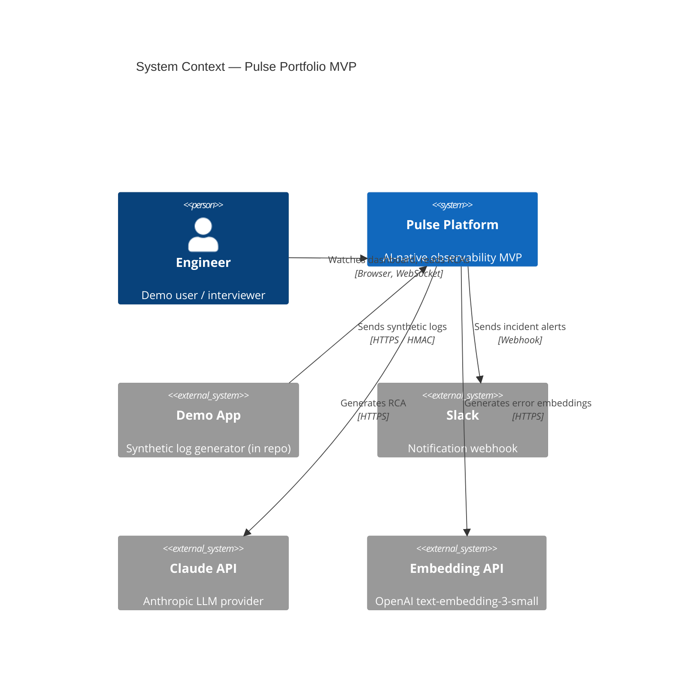
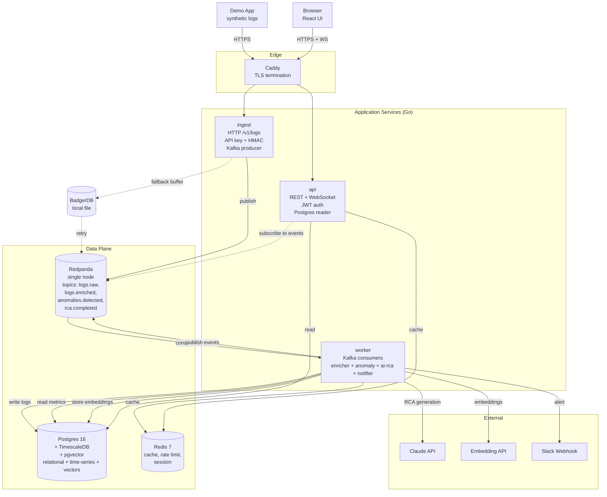
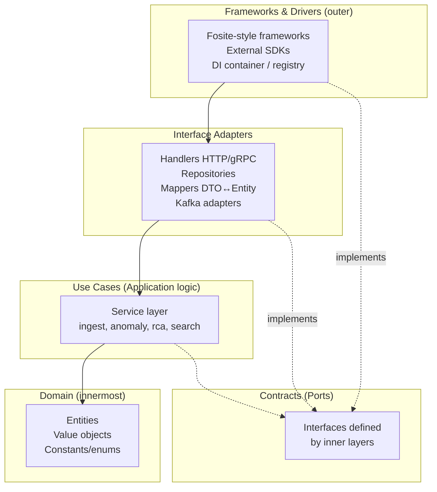
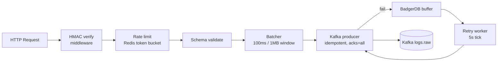
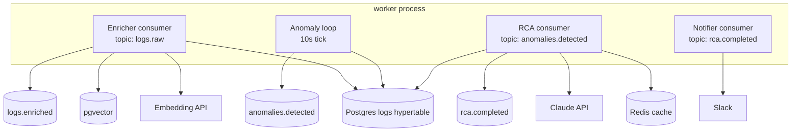
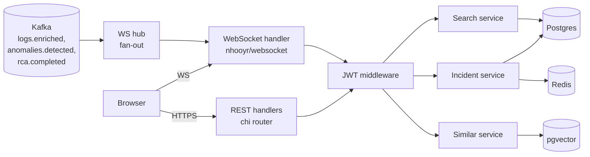
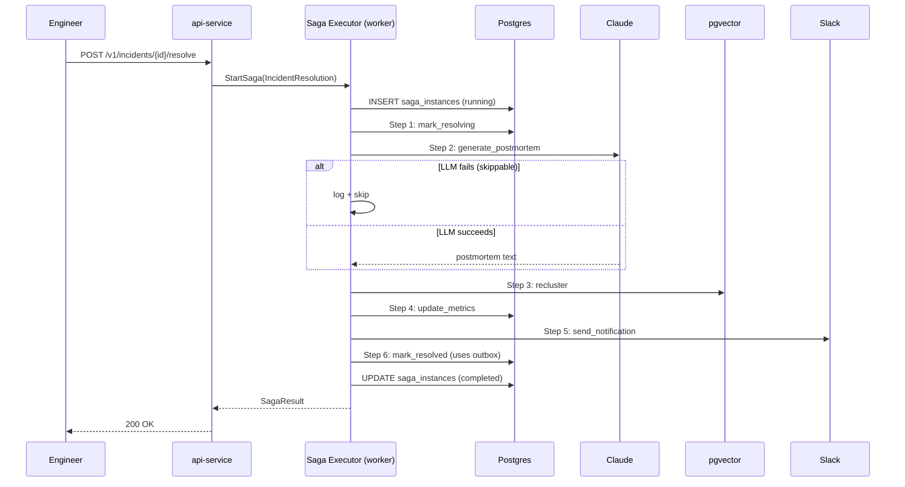

# Pulse — Solution Architecture Document

**Project:** Pulse — AI-Native Observability Platform (Portfolio Edition)
**Document type:** Solution Architecture (SA)
**Version:** 1.0
**Last updated:** 2026-05-09
**Status:** Side project for backend engineering interview portfolio
**Time budget:** ~150 hours over 12 weeks (2–3 hours/day)
**Owner:** Solo developer

---

## 0. Document Intent

This is a portfolio-grade architecture document, sized for a 12-week side project rather than a real production system. It deliberately keeps the structure of an enterprise SA doc — C4 diagrams, ADRs, threat model, deployment topology — because that itself is part of the interview signal. But every concrete decision is calibrated for the constraints: solo developer, ~150 hours total, single VPS for the live demo, $40/month infrastructure budget.

Where a real architecture would say "Kubernetes cluster across three regions," this one says "Docker Compose on one VPS, with a `# Future` note explaining what the production version would look like." That gap, deliberate and explained, is the architecture.

---

## 1. Executive Summary

Pulse is an event-driven log analytics platform built on three Go services, with Kafka (Redpanda) as the event backbone and a single Postgres instance acting as the unified data layer (relational + time-series via TimescaleDB + vector via pgvector). AI integration uses a tiered Claude model strategy with aggressive caching to keep costs predictable.

The architecture trades ambition for shipability. Three services instead of six. One Postgres instead of three databases. Docker Compose instead of Kubernetes. The result fits in 150 hours of focused work and produces a system that actually runs end-to-end on a $40/month VPS.

---

## 2. Goals & Constraints

### 2.1 Quality attributes (priority order)

**Shipability** — the entire system must run end-to-end by week 10 of a 12-week schedule. Every architectural decision is filtered through "can a solo developer build this in 2 hours/day?"

**Demo-readiness** — the system must produce a clear, repeatable demo: trigger anomaly → see AI RCA → drill into similar incidents.

**Cost predictability** — LLM cost is the largest unknown; it must have a hard ceiling.

**Code clarity** — the codebase will be read by interviewers. Cleanliness beats cleverness.

**Modest performance** — 10k logs/sec sustained, p99 ingest under 80ms. Enough to back up the README claim, well below "production scale."

### 2.2 Constraints

- ~150 hours total dev time.
- Solo developer, no DevOps support.
- $40/month infrastructure ceiling for the live demo.
- $5/day LLM cost ceiling (hard cap).
- Single primary language (Go) to minimize context-switching.
- Single VPS deployment (Hetzner CCX13: 4 vCPU, 16GB RAM).

### 2.3 Non-goals (deliberate exclusions)

- Production-grade multi-tenancy — `tenant_id` columns exist but isolation is not stress-tested.
- Compliance — no SOC 2 / HIPAA / GDPR work.
- Distributed tracing — flag as future work, do not implement.
- Auto-scaling — single replica per service.
- Multi-region — single region.
- Service mesh / mTLS — TLS at the edge only (Caddy).
- Custom metrics SDK — manual logger only.
- Multiple LLM providers — Anthropic only, but with an interface so swapping is straightforward.

---

## 3. System Context (C4 Level 1)



External dependencies are minimal. The demo app ships in the same repo. Slack is optional (cut path #1 if needed). Claude and the embedding provider are the only true externals.

---

## 4. Container Diagram (C4 Level 2)

Three services, one Postgres, one Redis, one Redpanda — the entire stack.



### 4.1 Service responsibilities

`ingest` is the front door. It only does authentication, validation, rate-limiting, and pushing to Kafka. Stateless. Has a BadgerDB local buffer for degradation when Kafka is down. This service is the load-test target — it's the one that gets benchmarked at 10k logs/sec.

`worker` is the pipeline brain. It runs multiple Kafka consumer groups in one binary:
- An enricher consumer (parses, fingerprints, writes to Postgres, generates embeddings on first sight of a new error).
- An anomaly detector loop (every 10s, queries TimescaleDB, computes z-score).
- An ai-rca consumer (consumes anomaly events, generates RCAs).
- A notifier consumer (consumes RCAs, sends Slack messages).

Combining these into one process is a deliberate side-project simplification. In production they'd be separate services to scale independently — that's noted in the ADRs.

`api` serves the dashboard. REST endpoints for incidents, search, similar incidents. WebSocket for live log fan-out. Subscribes to Kafka topics for real-time push.

### 4.2 Why not more services?

A "real" Pulse would have 6+ services. For 150 hours, that's wasted engineering on plumbing rather than features. Three services is the sweet spot: enough to demonstrate microservice thinking and inter-service contracts, few enough to actually finish.

### 4.3 Framework choice: go-zero

Pulse is built on [go-zero](https://github.com/zeromicro/go-zero), the same framework powering production codebases like `pmc-inapp-authentication-svc`. go-zero provides batteries-included primitives for the patterns this project needs:

- `rest` — HTTP server with middleware, JWT, rate limiting, breaker.
- `zrpc` — gRPC server/client with built-in tracing and metrics.
- `kq` — Kafka producer/consumer (from `go-queue`), idiomatic to go-zero's lifecycle.
- `stores/sqlx` + `stores/cache` + `stores/redis` — DB and cache abstractions with built-in cache-aside patterns.
- `logx`, `metric`, `trace` — observability primitives wired automatically.
- `conf` — YAML config loader (the `etc/*.yaml` convention).
- `goctl` — code generator that scaffolds services from `.api` / `.proto` definitions.

The architectural value of go-zero for this project: it removes ~30 hours of plumbing (HTTP middleware, Kafka consumer lifecycle, config loading, OTel wiring) and keeps the layout consistent with what interviewers in Vietnamese / Asian fintech teams already recognize.

### 4.4 Monorepo with multiple binaries

Although Pulse logically has 3 services, they live in a **single Go module** with multiple `cmd/` entry points (a pattern borrowed from production codebases like `pmc-inapp-authentication-svc`). One `go.mod`, one CI pipeline, shared `internal/` packages, but separate Dockerfiles produce separate container images.

This decision is critical: it means each service is a thin `main.go` that wires together shared layers. The actual logic lives in well-organized `internal/` packages following Clean Architecture (see Section 5).

---

## 5. Application Architecture (Clean Architecture)

Pulse follows Uncle Bob's Clean Architecture pattern, with strict separation between layers and a unidirectional dependency rule (outer layers depend on inner layers, never the reverse).

### 5.1 The Five Layers



### 5.2 Layer Responsibilities

| Layer | Project Location | Knows About | Does NOT Know About |
|---|---|---|---|
| **Domain / Entities** | `internal/types/entity/`, `internal/types/common/` | Pure Go types, business rules | DB, HTTP, Kafka, anything I/O |
| **Use Cases** | `internal/service/` | Domain entities, port interfaces | Concrete DB driver, gRPC, framework |
| **Interface Adapters** | `internal/handler/`, `internal/server/`, `internal/repository/`, `internal/types/mapper/` | Use cases, framework primitives (chi, pgx) | Business rules beyond what services expose |
| **Frameworks & Drivers** | `internal/llm/`, `internal/kafka/`, `external/`, `internal/registry/` | Concrete vendor SDKs, library configuration | Domain rules |
| **Contracts / Ports** | `internal/contract/`, `api/` (proto) | Pure interfaces and proto contracts | Implementation details |

### 5.3 The Dependency Rule in Practice

A service in `internal/service/anomaly_service.go` depends on:
- Entities from `internal/types/entity/` (allowed — inner layer).
- Repository interface from `internal/contract/` (allowed — port).
- It must NOT import `gorm.io/gorm` or `pgx` directly (would couple use case to driver).

The concrete repository in `internal/repository/incident_repository.go` implements `contract.IncidentRepository` and uses `pgx`. Wiring happens in `internal/registry/`.

This discipline is enforced by code review, not compiler — but Go's package import graph makes violations easy to spot in PRs.

### 5.4 Clean Architecture over go-zero (vocabulary translation)

go-zero's default scaffolding uses `handler` / `logic` / `svc` / `types`. The pmc-inapp reference (and this project) **rename and extend** that scaffold to map onto Clean Architecture vocabulary:

| go-zero default | Clean Architecture name | This project |
|---|---|---|
| `handler/` | Interface adapter (HTTP/gRPC) | `internal/handler/` |
| `logic/` | Use case | `internal/service/` (renamed via boilerplate convention) |
| `svc/` | DI container | `internal/registry/` (renamed; mirrors boilerplate's `ServiceContext`, `RepositoryContext`, `CronContext`, `ConsumerContext`) |
| `types/` | Request/response DTOs | `internal/types/request/`, `internal/types/mapper/` (split out) |
| (none) | Domain entity | `internal/types/entity/` (GORM struct tags; auto-migrated via `migrate.go`) |
| (none) | Repository | `internal/repository/` (GORM-backed; implements `internal/contract/` interfaces) |
| (none) | Port / Contract | `internal/contract/` (added) |
| (none) | Service factory | `internal/service/service_factory.go` — **auto-generated by `pmctl gen service`; DO NOT hand-edit** |
| `etc/*.yaml` | Config | `etc/*.yaml` + `internal/config/` (go-zero `conf.MustLoad` with `${ENV_VAR}` substitution) |

This is the **same trick** the pmc-inapp codebase uses. We keep go-zero's tooling (especially `goctl` codegen) while imposing the discipline of Clean Architecture on top of it. `goctl` still generates `handler/` and `types/` from `.api` files; we add `service/`, `repository/`, `entity/`, `contract/` by hand.

### 5.5 Why Clean Architecture for a 150-hour Side Project

Three reasons:

**Interview signal.** When a senior engineer reviews the repo, the layered structure tells them immediately that I think like a principal engineer, not a tutorial follower. The `pmc-inapp-authentication-svc` style is recognizably "production grade" in Vietnamese / Asian fintech engineering teams.

**Testability.** Services can be unit-tested with fake repositories and a fake LLM client (`internal/llm/fake.go`). No testcontainers needed for 80% of tests.

**Future-proofing on a budget.** When ADR-002 says "we'll swap TimescaleDB for ClickHouse later," that swap is a new repository implementation, not a rewrite. Clean Architecture earns its keep when (not if) the underlying decisions change.

The cost is ~5–8 extra hours of upfront wiring (writing interfaces, adapters, mappers). Worth it.

---

## 6. Component Design

### 5.1 ingest service



**Implementation notes:**
- HTTP framework: go-zero `rest.MustNewServer` (matches boilerplate; wires middleware, JWT, rate-limiting, breaker automatically).
- HMAC: stdlib `crypto/hmac` + `crypto/sha256` (reuse `helper/utils/toolkit/crypto.go` from boilerplate).
- Kafka: `segmentio/kafka-go` via go-queue/kq (same client the boilerplate ships; wraps producer/consumer lifecycle).
- Buffer: `dgraph-io/badger/v4` (local fallback; not in boilerplate helper — add to `internal/kafka/buffer.go`).
- JSON: stdlib `encoding/json` (boilerplate default; swap to sonic on hot path if benchmarks demand it).
- Config: go-zero `conf.MustLoad` reading `etc/ingest.yaml` (same `${ENV_VAR}` substitution pattern as boilerplate's `etc/app.yaml`).

**Capacity at this complexity:** one pod handles ~50k logs/sec when each request batches 10 entries. Real demo target is 10k/sec, so we're 5x over-provisioned — comfortable headroom for live demo.

### 5.2 worker service



Each consumer runs as a goroutine in the worker binary, with its own Kafka consumer group. Errors in one don't stop the others; a panic in one goroutine is caught and the goroutine is restarted by a supervisor pattern.

### 5.3 api service



The WebSocket hub is a small in-process pub/sub. Each browser WS connection registers a channel; messages from Kafka are filtered and pushed. Single-process, single-replica is fine for the demo (max ~100 connections).

---

## 7. Data Architecture

### 6.1 The "one Postgres" decision

This is the most consequential simplification. A real architecture would use ClickHouse for logs, Postgres for relational, a dedicated vector DB. Pulse uses one Postgres with three extensions:

- **TimescaleDB** for the logs table (hypertable, time-partitioned).
- **pgvector** for embeddings.
- **Standard Postgres** for tenants, users, incidents, audit.

This means one connection pool, one backup story, one set of migrations, one deployment unit. The cost is performance: TimescaleDB is slower than ClickHouse for log scans. But at 10k logs/sec, TimescaleDB is more than enough, and the operational simplicity buys back ~30 hours of dev time.

### 6.2 Schema (annotated)

```sql
-- Migrations live in db/migrations/, run via golang-migrate

-- 0001_init.sql
CREATE EXTENSION IF NOT EXISTS timescaledb;
CREATE EXTENSION IF NOT EXISTS vector;
CREATE EXTENSION IF NOT EXISTS pg_trgm;  -- for fuzzy text search
CREATE EXTENSION IF NOT EXISTS citext;

-- Tenants (single demo tenant in MVP, but designed for multi)
CREATE TABLE tenants (
  id UUID PRIMARY KEY DEFAULT gen_random_uuid(),
  slug VARCHAR(64) UNIQUE NOT NULL,
  name TEXT NOT NULL,
  created_at TIMESTAMPTZ DEFAULT now()
);

CREATE TABLE users (
  id UUID PRIMARY KEY DEFAULT gen_random_uuid(),
  tenant_id UUID REFERENCES tenants(id),
  email CITEXT UNIQUE NOT NULL,
  password_hash TEXT NOT NULL,
  role VARCHAR(32) DEFAULT 'member',
  created_at TIMESTAMPTZ DEFAULT now()
);

CREATE TABLE api_keys (
  id UUID PRIMARY KEY DEFAULT gen_random_uuid(),
  tenant_id UUID REFERENCES tenants(id),
  prefix VARCHAR(16) NOT NULL,
  hash TEXT NOT NULL,
  scopes TEXT[] NOT NULL DEFAULT '{}',
  revoked_at TIMESTAMPTZ,
  created_at TIMESTAMPTZ DEFAULT now()
);

-- 0002_logs_hypertable.sql
CREATE TABLE logs (
  id BIGSERIAL,
  tenant_id UUID NOT NULL,
  service VARCHAR(128) NOT NULL,
  timestamp TIMESTAMPTZ NOT NULL,
  severity VARCHAR(16) NOT NULL,
  message TEXT NOT NULL,
  fingerprint CHAR(32) NOT NULL,
  trace_id VARCHAR(64),
  attributes JSONB,
  PRIMARY KEY (id, timestamp)
);
SELECT create_hypertable('logs', 'timestamp', chunk_time_interval => INTERVAL '1 day');
CREATE INDEX logs_tenant_service_time_idx ON logs (tenant_id, service, timestamp DESC);
CREATE INDEX logs_fingerprint_idx ON logs (fingerprint, timestamp DESC);

-- Compression policy (TimescaleDB)
ALTER TABLE logs SET (timescaledb.compress, timescaledb.compress_segmentby = 'service, severity');
SELECT add_compression_policy('logs', INTERVAL '7 days');
SELECT add_retention_policy('logs', INTERVAL '30 days');

-- 0003_metrics_rollup.sql
CREATE MATERIALIZED VIEW logs_metrics_5min
WITH (timescaledb.continuous) AS
SELECT
  tenant_id,
  service,
  time_bucket('5 minutes', timestamp) AS bucket,
  count(*) AS total,
  count(*) FILTER (WHERE severity = 'error') AS errors,
  count(*) FILTER (WHERE severity = 'error')::float / count(*) AS error_rate
FROM logs
GROUP BY tenant_id, service, bucket;

SELECT add_continuous_aggregate_policy('logs_metrics_5min',
  start_offset => INTERVAL '1 hour',
  end_offset => INTERVAL '5 minutes',
  schedule_interval => INTERVAL '1 minute');

-- 0004_incidents.sql
CREATE TABLE incidents (
  id UUID PRIMARY KEY DEFAULT gen_random_uuid(),
  tenant_id UUID NOT NULL,
  service VARCHAR(128) NOT NULL,
  fingerprint CHAR(32) NOT NULL,
  status VARCHAR(32) NOT NULL DEFAULT 'open',
  severity VARCHAR(16) NOT NULL,
  z_score DOUBLE PRECISION,
  detected_at TIMESTAMPTZ NOT NULL,
  acknowledged_at TIMESTAMPTZ,
  acknowledged_by UUID REFERENCES users(id),
  resolved_at TIMESTAMPTZ,
  resolved_by UUID REFERENCES users(id),
  resolution_category VARCHAR(64),
  resolution_note TEXT,
  rca_summary TEXT,
  rca_likely_cause TEXT,
  rca_suggested_actions JSONB,
  rca_evidence_log_ids BIGINT[],
  rca_cached BOOLEAN DEFAULT false,
  rca_cost_usd NUMERIC(10,6),
  created_at TIMESTAMPTZ DEFAULT now()
);
CREATE INDEX incidents_tenant_status_idx ON incidents(tenant_id, status, detected_at DESC);

-- 0005_embeddings.sql
CREATE TABLE error_embeddings (
  id UUID PRIMARY KEY DEFAULT gen_random_uuid(),
  tenant_id UUID NOT NULL,
  fingerprint CHAR(32) NOT NULL,
  service VARCHAR(128) NOT NULL,
  sample_message TEXT NOT NULL,
  embedding vector(1536),
  occurrence_count INT DEFAULT 1,
  first_seen TIMESTAMPTZ DEFAULT now(),
  last_seen TIMESTAMPTZ DEFAULT now(),
  UNIQUE (tenant_id, fingerprint)
);
CREATE INDEX error_embeddings_vec_idx ON error_embeddings USING hnsw (embedding vector_cosine_ops);

-- 0006_llm_calls.sql (cost tracking)
CREATE TABLE llm_calls (
  id BIGSERIAL PRIMARY KEY,
  tenant_id UUID NOT NULL,
  feature VARCHAR(64) NOT NULL,
  model VARCHAR(64) NOT NULL,
  input_tokens INT NOT NULL,
  output_tokens INT NOT NULL,
  cost_usd NUMERIC(10,6) NOT NULL,
  latency_ms INT,
  cache_hit BOOLEAN DEFAULT false,
  incident_id UUID REFERENCES incidents(id),
  created_at TIMESTAMPTZ DEFAULT now()
);
CREATE INDEX llm_calls_time_idx ON llm_calls(created_at DESC);

-- 0007_audit.sql
CREATE TABLE audit_logs (
  id BIGSERIAL PRIMARY KEY,
  tenant_id UUID NOT NULL,
  actor_id UUID,
  action VARCHAR(64) NOT NULL,
  target_type VARCHAR(64),
  target_id TEXT,
  payload JSONB,
  ip_address INET,
  created_at TIMESTAMPTZ DEFAULT now()
);
```

Notes on this schema:
- Single demo tenant in practice — the `tenant_id` columns are there to show isolation thinking, not enforced via RLS in MVP.
- `logs_metrics_5min` continuous aggregate is what the anomaly detector queries — much faster than aggregating raw logs every 10 seconds.
- `error_embeddings` is small (one row per unique fingerprint), so HNSW is fast.

---

## 8. API Design

### 7.1 Ingestion

```http
POST /v1/logs HTTP/1.1
Authorization: Bearer pk_demo_xxx
X-Signature: sha256=<hmac of body>
Content-Type: application/json

{
  "logs": [
    {
      "timestamp": "2026-05-09T10:23:45Z",
      "service": "checkout",
      "severity": "error",
      "message": "payment gateway returned 503",
      "trace_id": "abc123"
    }
  ]
}

→ 202 Accepted
{ "accepted_count": 1, "request_id": "req_xyz" }
```

### 7.2 Read API (selected endpoints)

```
POST   /v1/auth/login                     { email, password } → { access_token, refresh_token }
POST   /v1/auth/refresh                   { refresh_token } → { access_token }

GET    /v1/incidents?status=open&limit=20
GET    /v1/incidents/{id}
POST   /v1/incidents/{id}/ack             { comment? }
POST   /v1/incidents/{id}/resolve         { category, note }
GET    /v1/incidents/{id}/similar
GET    /v1/incidents/{id}/rca

GET    /v1/logs/search?q=<text>&service=<svc>&from=<ts>&to=<ts>

GET    /v1/insights/cost?range=7d
GET    /v1/health
GET    /v1/metrics                        # Prometheus exposition
```

Total endpoints: 12. Small enough to maintain in 150 hours, large enough to demonstrate REST design.

### 7.3 WebSocket protocol

```
Connect:  ws://host/v1/stream?token=<jwt>

Subscribe:
  → { "action": "subscribe", "channel": "logs", "filter": {"service":"checkout"} }

Receive:
  ← { "type": "log", "data": {...} }
  ← { "type": "incident", "data": {...} }
  ← { "type": "rca", "data": {...} }

Heartbeat:
  ← { "type": "ping" } every 30s
```

---

## 9. Event Schema (Kafka)

Three topics, all with single-tenant routing for the MVP. JSON-encoded events with a small wrapper.

| Topic | Partition key | Retention | Purpose |
|---|---|---|---|
| `logs.raw` | service | 24h | Pre-enrichment ingest sink |
| `logs.enriched` | service | 6h | Post-enrichment, fanout to api |
| `anomalies.detected` | service | 7d | Anomaly events |
| `rca.completed` | service | 7d | RCA-done events |

Single Redpanda node, replication factor 1 (acceptable for MVP — note in README).

```json
// anomalies.detected
{
  "event_id": "evt_01HXYZ",
  "event_version": "1",
  "tenant_id": "demo",
  "service": "checkout",
  "metric": "error_rate",
  "z_score": 4.2,
  "current_value": 0.124,
  "baseline_mean": 0.003,
  "fingerprint": "a1b2c3...",
  "detected_at": "2026-05-09T10:25:12Z"
}
```

### 9.3 Outbox Pattern for Reliable Event Publishing

Pulse has multiple places where a database write and a Kafka publish must happen "together" — the **dual-write problem**. Without a coordination mechanism, you get either lost events (DB ok, Kafka fail → dashboard never updates) or phantom events (Kafka ok, DB rolled back → consumers act on data that doesn't exist).

The three sites where this matters:

| Site | DB write | Kafka publish |
|---|---|---|
| RCA completion | `UPDATE incidents SET rca_summary = ...` | `rca.completed` event |
| Incident lifecycle | `UPDATE incidents SET status = ...` | `incident.resolved` / `incident.acknowledged` |
| Alert rule changes | `UPSERT alert_rules` | `alert_rule.changed` (forces anomaly-service to reload cache) |

The fix is the **Outbox Pattern**: append an event row to an `outbox_events` table inside the same Postgres transaction as the business write. A separate publisher process drains the outbox and pushes to Kafka with at-least-once semantics. Consumers must be idempotent (handled via `event_id` deduplication).

#### Schema

```sql
-- 0008_outbox.up.sql
CREATE TABLE outbox_events (
  id              UUID PRIMARY KEY DEFAULT gen_random_uuid(),
  tenant_id       UUID NOT NULL,
  aggregate_type  VARCHAR(64) NOT NULL,    -- 'incident', 'rca', 'alert_rule'
  aggregate_id    UUID NOT NULL,
  event_type      VARCHAR(64) NOT NULL,    -- 'rca.completed', 'incident.resolved'
  event_version   VARCHAR(8) NOT NULL DEFAULT '1',
  topic           VARCHAR(128) NOT NULL,
  partition_key   VARCHAR(128) NOT NULL,
  payload         JSONB NOT NULL,
  headers         JSONB,
  created_at      TIMESTAMPTZ DEFAULT now(),
  published_at    TIMESTAMPTZ,
  attempts        INT DEFAULT 0,
  next_retry_at   TIMESTAMPTZ DEFAULT now(),
  last_error      TEXT
);

-- Hot index covers only unpublished rows — keeps it tiny
CREATE INDEX outbox_pending_idx
  ON outbox_events (next_retry_at)
  WHERE published_at IS NULL;
```

#### Service-layer usage (atomic write)

```go
// internal/service/rca_service.go
func (s *RCAService) Persist(ctx context.Context, inc entity.Incident, rca entity.RCA) error {
    return s.txMgr.RunInTx(ctx, func(tx contract.Tx) error {
        // Both writes share one transaction — atomic
        if err := s.incidentRepo.UpdateRCATx(tx, inc.ID, rca); err != nil {
            return err
        }
        return s.outbox.AppendTx(tx, outbox.Event{
            TenantID:      inc.TenantID,
            AggregateType: "incident",
            AggregateID:   inc.ID,
            EventType:     "rca.completed",
            Topic:         "rca.completed",
            PartitionKey:  inc.TenantID.String(),
            Payload:       map[string]any{"incident_id": inc.ID, "summary": rca.Summary},
        })
    })
}
```

#### Outbox publisher (runs inside `cmd/worker`)

```go
// internal/outbox/publisher.go
func (p *Publisher) drain(ctx context.Context) {
    events, err := p.repo.FetchPending(ctx, 100)  // FOR UPDATE SKIP LOCKED
    if err != nil {
        return
    }
    for _, e := range events {
        if err := p.kafka.Publish(ctx, e.Topic, e.PartitionKey, e.Payload, e.Headers); err != nil {
            backoff := time.Duration(math.Pow(2, float64(e.Attempts))) * time.Second
            if backoff > 5*time.Minute {
                backoff = 5 * time.Minute
            }
            p.repo.MarkRetry(ctx, e.ID, e.Attempts+1, time.Now().Add(backoff), err.Error())
            continue
        }
        p.repo.MarkPublished(ctx, e.ID)
    }
}
```

`FOR UPDATE SKIP LOCKED` is the key SQL trick: when scaled to multiple worker pods, each pod safely picks up a different batch with no double-publishing.

#### Migration path to CDC

For MVP, polling at 500ms is sufficient (typical event latency: ~250ms). **In production**, the same `outbox_events` table is consumed by **Debezium** via Postgres logical replication, achieving sub-100ms latency without polling overhead. The schema is deliberately CDC-compatible (one row = one event, no soft-delete semantics, immutable payload). This migration is documented as future work.

#### Idempotency on the consumer side

Consumers persist `processed_event_ids` (Redis SET with TTL) keyed by `event_id`. On startup, they reject any event whose ID has been seen in the last hour. This handles the at-least-once semantics introduced by the outbox.

### 9.4 Saga Pattern for the Incident Resolution Workflow

When an engineer clicks **Resolve**, six things must happen across multiple systems, and step ordering matters:

```
1. Mark incident status = 'resolving'           [Postgres]
2. Generate postmortem draft via LLM            [Anthropic API — slow, can fail]
3. Recompute similar-incident clusters          [pgvector — slow]
4. Update SLI/SLO metrics                       [Postgres]
5. Send postmortem draft to Slack/email         [external]
6. Mark incident status = 'resolved'            [Postgres]
```

This cannot be one ACID transaction (steps 2, 3, 5 cross system boundaries). The Saga Pattern composes it as a sequence of local actions, each with an explicit compensation policy when the next step fails.

#### Choreography vs Orchestration

| | Choreography | Orchestration |
|---|---|---|
| State location | Distributed across services | Centralized in saga_instances table |
| Visibility | Hard to debug | Step-by-step audit log |
| Coupling | Looser | Orchestrator knows all steps |
| Pulse choice | — | ✓ (chosen) |

Pulse uses **orchestration** because the workflow has 6 sequential steps with business invariants (e.g., "step 6 must always run, even if 2–5 partially fail"). State machine in one place keeps the code reviewable.

#### Schema

```sql
-- 0009_saga.up.sql
CREATE TABLE saga_instances (
  id                 UUID PRIMARY KEY DEFAULT gen_random_uuid(),
  saga_type          VARCHAR(64) NOT NULL,
  tenant_id          UUID NOT NULL,
  correlation_id     UUID NOT NULL,            -- e.g., incident_id
  status             VARCHAR(32) NOT NULL,     -- pending|running|completed|compensating|failed
  current_step       VARCHAR(64),
  steps_log          JSONB DEFAULT '[]',       -- [{step, status, started, finished, result, error}]
  context            JSONB NOT NULL,           -- saga input
  result             JSONB,
  started_at         TIMESTAMPTZ DEFAULT now(),
  updated_at         TIMESTAMPTZ DEFAULT now(),
  completed_at       TIMESTAMPTZ,
  last_error         TEXT
);

-- Idempotency: prevent duplicate concurrent sagas for same correlation
CREATE UNIQUE INDEX saga_unique_correlation
  ON saga_instances (saga_type, correlation_id)
  WHERE status NOT IN ('completed', 'failed');
```

#### Step + compensation interface

```go
// internal/saga/saga.go
type Step interface {
    Name() string
    Execute(ctx context.Context, sagaCtx *Context) (any, error)
    Compensate(ctx context.Context, sagaCtx *Context, prevResult any) error
    CanSkip() bool   // for non-critical steps
}

type Context struct {
    InstanceID   uuid.UUID
    Input        map[string]any
    StepResults  map[string]any
}
```

#### Compensation policy per step

| Step | On failure | Why |
|---|---|---|
| 1. mark_resolving | Compensate (revert to ack/open) | DB write, must rollback |
| 2. generate_postmortem | **Skip with audit log** | LLM is best-effort, not critical |
| 3. recluster_embeddings | Retry × 3, then skip | Eventual consistency acceptable |
| 4. update_metrics | Retry × 3, then skip | Metrics are observability-only |
| 5. send_notification | Retry × 5 with fallback channel | Important but not blocking |
| 6. mark_resolved | Always run | Business invariant |

This **mixed-strategy compensation** is the senior-level distinction: not every step needs a clean rollback. Some are best-effort, some are mandatory, some can degrade. Encoding this explicitly in `CanSkip()` and per-step compensation logic is what separates a real saga from a try/catch dressed up.

#### Executor (single goroutine inside `cmd/worker`)

```go
// internal/saga/executor.go
func (e *Executor) Run(ctx context.Context, saga Saga, sc *Context) error {
    instance, _ := e.repo.Create(ctx, saga.Type(), sc)
    e.repo.UpdateStatus(ctx, instance.ID, "running")
    
    var executed []Step
    for _, step := range saga.Steps() {
        e.repo.UpdateCurrentStep(ctx, instance.ID, step.Name())
        result, err := step.Execute(ctx, sc)
        if err != nil {
            e.repo.AppendStepLog(ctx, instance.ID, step.Name(), "failed", err.Error())
            if step.CanSkip() {
                logx.Errorf("saga %s: step %s skipped: %v", instance.ID, step.Name(), err)
                continue
            }
            return e.compensate(ctx, instance.ID, executed, sc)
        }
        sc.StepResults[step.Name()] = result
        executed = append(executed, step)
        e.repo.AppendStepLog(ctx, instance.ID, step.Name(), "succeeded", "")
    }
    e.repo.MarkCompleted(ctx, instance.ID)
    return nil
}
```

#### Saga + Outbox composition

Saga steps that need to publish Kafka events (e.g., step 6 `mark_resolved` should also fire `incident.resolved`) **use the outbox internally**. The two patterns compose:

- **Saga** orchestrates the multi-step business workflow with explicit compensation.
- **Outbox** ensures each step's DB write and Kafka publish are atomic.

#### Sequence diagram



#### Idempotency on saga restart

If the worker pod crashes mid-saga, on restart it queries `saga_instances WHERE status='running'` and resumes from `current_step`. Each step must be idempotent — re-executing step 3 should be safe even if it partially completed before the crash. The recluster step achieves this via upsert; the LLM step achieves it via fingerprint cache (same input → same cached output).

---

## 10. AI Integration Architecture

The AI layer is the differentiator. Three principles drive the design.

### 10.1 Tiered model strategy

| Task | Model | Why |
|---|---|---|
| RCA generation | Claude Sonnet 4.6 | Quality matters; this is what users read |
| (Future) NL→SQL | Claude Haiku 4.5 | Cheap, simple |
| Embedding | OpenAI text-embedding-3-small | $0.02 / 1M tokens, good quality |

In MVP, only RCA uses an LLM. Haiku is set up in the abstraction layer for future expansion.

### 10.2 Caching strategy

```mermaid
graph TB
    ANOM[Anomaly fires] --> FP[Compute fingerprint]
    FP --> L1{L1: Redis<br/>rca:{fp}<br/>TTL 30min}
    L1 -->|hit| RETURN[Return cached RCA<br/>~50ms total]
    L1 -->|miss| L2{L2: Postgres<br/>incidents.rca_summary<br/>same fp + recent}
    L2 -->|hit, < 24h old| RETURN_DB[Return DB RCA<br/>refresh L1]
    L2 -->|miss or stale| GEN[Generate via Sonnet]
    GEN --> SAVE[Write to Postgres + Redis]
    SAVE --> RETURN_NEW[Return fresh RCA]
```

Demo target: 60% cache hit rate after warmup. The demo includes a script that seeds a few "common error patterns" so the cache hit rate looks realistic from the first incident.

### 10.3 Cost ceiling (the kill switch)

Every Sonnet call writes to `llm_calls`. A goroutine in `worker` checks the day's total every 10 minutes. If it exceeds $5, set a flag in Redis: `llm:disabled=true`. The RCA path checks this flag and falls back to rule-based templates immediately.

```go
// internal/llm/budget.go
type BudgetGuard struct {
    db          *pgxpool.Pool
    redis       *redis.Client
    dailyLimitUSD float64
}

func (b *BudgetGuard) Check(ctx context.Context) (allowed bool, reason string) {
    if v, _ := b.redis.Get(ctx, "llm:disabled").Result(); v == "true" {
        return false, "daily budget exhausted"
    }
    // periodic recalc happens elsewhere
    return true, ""
}
```

This is a simple feature but it's the kind of thing interviewers love. "How do you prevent cost overruns?" → "Hard daily cap with kill switch, see `internal/llm/budget.go`."

### 10.4 LLM abstraction

```go
type LLMClient interface {
    Generate(ctx context.Context, req GenerateRequest) (*GenerateResponse, error)
    Embed(ctx context.Context, text string) ([]float32, error)
}

// Implementations:
// - AnthropicClient (production)
// - FakeClient (tests; returns deterministic output)
```

Only one real implementation, but the interface lets every consumer be tested with `FakeClient`. This is the kind of small detail that makes interview reviewers nod.

### 10.5 Prompt template (the actual one used)

Stored in `internal/llm/prompts/rca.tmpl`:

```
You are an SRE assistant. Analyze the following anomaly and produce a JSON RCA.

CONTEXT
Service: {{.Service}}
Anomaly: {{.AnomalyType}} (z-score {{.ZScore}})
Window: {{.WindowStart}} → {{.WindowEnd}}
Current error rate: {{.CurrentRate}}, baseline: {{.BaselineMean}}

TOP ERRORS BY FREQUENCY
{{range .TopErrors}}
- [{{.Count}}x] {{.Message}}
{{end}}

SIMILAR PAST INCIDENTS
{{range .SimilarIncidents}}
- [{{.Date}}] resolved by: {{.ResolutionNote}}
{{end}}

OUTPUT
Respond with JSON only, no markdown fence:
{
  "summary": "1–2 sentences",
  "likely_cause": "specific hypothesis with evidence",
  "confidence": "low|medium|high",
  "suggested_actions": ["...", "..."]
}
```

JSON-mode output is enforced via the Anthropic SDK's `tool_choice`. If the response doesn't parse, retry once with the parse error appended; on second failure, fall back to rule-based.

---

## 11. Security Architecture (right-sized)

### 10.1 Threat model — the small version

Even a portfolio project should have a threat model. Mine fits in one page.

| Threat | Likelihood | Mitigation |
|---|---|---|
| Forged ingest request | Medium | API key + HMAC over body |
| SQL injection | Low | Parameterized queries (pgx), no string concat |
| XSS in dashboard | Medium | React auto-escapes; CSP header via Caddy |
| JWT theft (XSS) | Low | httpOnly cookies for refresh; short-lived access |
| LLM cost-DoS | Medium | Hard daily $5 cap with kill switch |
| Demo VPS compromise | Low | UFW firewall; only 80/443 open; SSH key-only |
| Secrets in repo | Critical | `.env.example` only; `.env` in `.gitignore`; pre-commit `gitleaks` hook |

### 10.2 Auth flow

Simple session-based JWT. Access token 15 minutes, refresh token 30 days, refresh rotation on use. bcrypt for password hashing (cost factor 12).

```mermaid
sequenceDiagram
    participant U as User
    participant UI as Browser
    participant API as api service
    participant PG as Postgres

    U->>UI: email + password
    UI->>API: POST /v1/auth/login
    API->>PG: SELECT user; bcrypt.Compare
    PG-->>API: ok
    API-->>UI: access (15m JWT) + refresh (30d cookie)
    
    Note over UI,API: subsequent requests
    UI->>API: GET /v1/incidents (Bearer access)
    API->>API: verify JWT
    API->>PG: SELECT (no RLS in MVP, but tenant_id filter)
    PG-->>API: data
    API-->>UI: response
```

### 10.3 Secret management

`.env` file, mode 0600, lives only on the VPS. Loaded via `caarlos0/env`. Never committed.

In a "future work" note: migrate to systemd `LoadCredential=` or sealed-secrets when going production.

---

## 12. Performance & Capacity

### 11.1 Targets

| Metric | Target | How verified |
|---|---|---|
| Ingest throughput | 10,000 logs/sec sustained | k6 load test |
| Ingest p99 latency | < 80ms | k6 + Prometheus histogram |
| Dashboard log latency | < 3s end-to-end | manual demo |
| RCA generation p95 | < 15s | Prometheus |
| Search query p95 | < 1s with 7-day range | k6 |
| WebSocket capacity | 100 concurrent connections | manual test |

### 11.2 Single-VPS budget

```
Hetzner CCX13 (4 vCPU, 16GB RAM, 80GB SSD): $15/month
Domain (Namecheap): $1/month
Embedded Postgres + Redis + Redpanda fit comfortably:
- Postgres: ~2GB RAM, 10GB disk after 30 days
- Redpanda: ~1GB RAM (configured for low retention)
- Redis: ~512MB RAM
- App services: ~500MB RAM each
- Headroom: 8+ GB free
```

Total: ~$16/month. Well under the $40/month ceiling.

### 11.3 What breaks at higher scale (the "future work" answer)

If asked "how would you scale this to 1M logs/sec?":
- Replace TimescaleDB with ClickHouse for logs.
- Split worker into separate enricher / anomaly / rca / notifier services.
- Run Redpanda 3-node with replication factor 3.
- Move Postgres to a managed service (RDS / Crunchy).
- Add a CDN / load balancer in front of ingest.
- Switch to Kubernetes with HPA on ingest.

Documented in the README as "scaling considerations" so interviewers see I know.

---

## 13. Observability of Pulse Itself

Even meta-observability gets a small treatment in MVP.

- **Logs:** structured JSON via `slog`, written to stdout, captured by Docker.
- **Metrics:** Prometheus client library, `/metrics` endpoint per service. RED metrics on every HTTP/WS handler.
- **Traces:** **deferred.** Mention OpenTelemetry as future. Adding traces to all 3 services costs ~10 hours and the demo doesn't need it.
- **Dashboard:** one Grafana instance in the Docker Compose, with two dashboards: "Pulse Internals" and "Demo Tenant".

---

## 14. Deployment Architecture

### 13.1 Docker Compose (the only deployment in MVP)

```yaml
# deploy/docker-compose.yml (excerpt)
services:
  caddy:
    image: caddy:2-alpine
    ports: [80:80, 443:443]
    volumes: [./Caddyfile:/etc/caddy/Caddyfile, caddy_data:/data]
    
  postgres:
    image: timescale/timescaledb-ha:pg16-all
    environment:
      POSTGRES_PASSWORD_FILE: /run/secrets/pg_password
    volumes: [pg_data:/var/lib/postgresql/data]
    
  redis:
    image: redis:7-alpine
    volumes: [redis_data:/data]
    
  redpanda:
    image: redpandadata/redpanda:latest
    command:
      - redpanda start
      - --smp 1
      - --memory 1G
      - --reserve-memory 0M
      - --overprovisioned
      - --node-id 0
      - --check=false
      
  ingest:
    build: { context: ., target: ingest }
    environment:
      DB_URL, KAFKA_BROKERS, REDIS_URL
    depends_on: [postgres, redpanda, redis]
    
  worker:
    build: { context: ., target: worker }
    environment:
      DB_URL, KAFKA_BROKERS, REDIS_URL, ANTHROPIC_API_KEY
    depends_on: [postgres, redpanda, redis]
    
  api:
    build: { context: ., target: api }
    environment:
      DB_URL, KAFKA_BROKERS, REDIS_URL, JWT_SECRET
    depends_on: [postgres, redpanda, redis]
    
  prometheus:
    image: prom/prometheus
    volumes: [./prometheus.yml:/etc/prometheus/prometheus.yml]
    
  grafana:
    image: grafana/grafana
    volumes: [./grafana:/var/lib/grafana]

volumes:
  pg_data: {}
  redis_data: {}
  caddy_data: {}
```

### 13.2 Production-deployment story (future work)

A short section in the README explains: *"To take this to production, swap Docker Compose for Kubernetes with the included Helm chart skeleton; switch Postgres to a managed service; run Redpanda with 3-node replication; add ArgoCD for GitOps. None of this is needed for the demo, but I've left a stub Helm chart in `deploy/helm/` to show the structure."*

That stub is two `Chart.yaml` files and one `values.yaml`. Five minutes of work, big interview signal.

### 13.3 CI/CD

GitHub Actions workflow:

```yaml
on: [push, pull_request]
jobs:
  test:
    - go install
    - golangci-lint run
    - go test -race ./...
    - go test -bench=. -benchmem (for ingest only)
  build:
    - docker build for each service
    - push to ghcr.io on tag
```

That's it. No CD to production — manual `docker compose pull && up -d` on the VPS via SSH. (Future work: GitHub Actions deploy via SSH or watchtower.)

---

## 15. Architecture Decision Records (9 chosen)

Each ADR is short — half a page max. Five is enough to show I think this way without burying interviewers.

### ADR-001: Three services instead of six

**Context:** A "real" architecture for this would split ingest, enricher, anomaly, ai-rca, notifier, api. Six services.
**Decision:** Combine enricher + anomaly + ai-rca + notifier into one `worker` binary running multiple consumer groups.
**Rationale:** 150-hour budget. Each additional service costs ~10 hours of plumbing (Dockerfile, Kafka client setup, observability wiring). The combined worker still has clean internal boundaries (separate packages per consumer).
**Consequences:** Cannot scale consumers independently. Acceptable at demo scale; flagged for production.

### ADR-002: Postgres + extensions instead of polyglot persistence

**Context:** Real Pulse uses ClickHouse + Postgres + dedicated vector DB.
**Decision:** Postgres 16 with TimescaleDB hypertable + pgvector + standard tables.
**Rationale:** One DB to operate, one connection pool, one backup story. TimescaleDB handles 10k inserts/sec comfortably. pgvector handles < 100k vectors trivially.
**Consequences:** Hard ceiling around 50k logs/sec. Not a problem for MVP. Migration path to ClickHouse is documented.

### ADR-003: TimescaleDB continuous aggregates for metrics

**Context:** Anomaly detector runs every 10 seconds and needs error-rate-per-service.
**Decision:** Pre-aggregate via continuous materialized view `logs_metrics_5min`.
**Rationale:** Querying raw logs every 10s would scan a moving window of millions of rows. Continuous aggregate refreshes incrementally.
**Consequences:** Adds one extension dependency. Slight write amplification.

### ADR-004: Hard LLM cost cap with kill switch

**Context:** AI cost is the most volatile expense and a portfolio demo could get scraped.
**Decision:** Track every call in `llm_calls`. Goroutine recomputes day-total every 10 min. If > $5/day, set `llm:disabled=true` in Redis. RCA path checks flag and falls back to rule-based.
**Rationale:** Bounded blast radius. Recovers automatically next day.
**Consequences:** Demo could fail mid-walkthrough if cap is hit. Mitigation: warm-cache the demo so most RCAs are L1 hits.

### ADR-005: Single VPS deployment, not Kubernetes

**Context:** "Deploy your microservices to k8s" is the trendy answer.
**Decision:** Docker Compose on one Hetzner VPS.
**Rationale:** k8s setup + ops is ~30 hours and adds zero capability for a demo. The k8s migration story is documented as "future work" with a stub Helm chart, which signals knowledge without requiring the work.
**Consequences:** Cannot demo HPA, rolling deploys, etc. Acceptable trade-off.

### ADR-006: Clean Architecture monorepo with multiple `cmd/` binaries

**Context:** Three logical services (ingest, api, worker, plus cron) need to share types, repositories, Kafka clients, LLM clients, and config. Two structural options: (a) three Go modules with a shared library module, or (b) one Go module with multiple `cmd/` entry points organized by Clean Architecture layers (the pattern used by `pmc-inapp-authentication-svc`).

**Decision:** Option (b). Single `go.mod`. `cmd/api`, `cmd/ingest`, `cmd/worker`, `cmd/cron`, `cmd/sim`. Strict layer boundaries inside `internal/`: domain types in `internal/types/entity/`, use cases in `internal/service/`, adapters in `internal/handler/` + `internal/repository/` + `internal/types/mapper/`, frameworks in `internal/llm/` + `internal/kafka/` + `external/`, ports in `internal/contract/`. Per-binary wiring lives in `internal/registry/` so `main.go` files stay tiny.

**Rationale:**
- Shared code (types, contracts, helpers) is imported, not vendored. Refactors propagate atomically.
- One CI pipeline, one set of golangci-lint rules, one test command.
- Layer discipline keeps the codebase reviewable. Interviewers familiar with Clean Architecture (or with similar production layouts) recognize the structure on sight.
- Separate Dockerfiles per `cmd/` produce thin per-service images (~25MB Go static binaries) so deployment isolation is preserved.
- Mirroring an established production layout (`pmc-inapp-authentication-svc`) signals fluency with real-world Go service architecture rather than tutorial patterns.

**Consequences:**
- ~5–8 hours of upfront wiring (interfaces, mappers, registry contexts) before the first feature ships.
- Cannot publish a single library module independently — all consumers of the codebase are in this repo.
- Discipline must be enforced at code review (Go compiler doesn't prevent a `service/` file from importing `gorm`).

**Alternatives considered:**
- **Three repos with shared library:** rejected. Library versioning, sync friction, and CI overhead are not worth the "true microservice repo" cosplay at portfolio scale.
- **Flat package layout** (`pkg/log`, `pkg/incident`, no layered separation): rejected. Hides dependency direction, reads like a tutorial project.
- **Hexagonal / Ports-and-Adapters with a different folder vocabulary:** essentially the same idea; chose Clean Architecture vocabulary because it's the dominant convention in the reference codebase and most likely to be recognized by Vietnamese / Asian fintech interviewers.

### ADR-007: go-zero as the application framework

**Context:** Need to choose an HTTP/RPC framework. Options in the Go ecosystem: stdlib `net/http` + chi, gin/echo + manual wiring, kratos (bilibili), go-zero, or build-from-scratch.

**Decision:** go-zero. Use `rest` for HTTP, `zrpc` for gRPC, `kq` (from `go-queue`) for Kafka, `stores/sqlx` + `stores/cache` for DB and cache abstractions. Use `goctl` for code generation from `.api` and `.proto` files.

**Rationale:**
- Removes ~30 hours of plumbing: HTTP middleware chain, Kafka consumer lifecycle, OTel/Prometheus auto-wiring, config loading, graceful shutdown, breaker / rate-limit primitives.
- `goctl` enforces consistency between API contract (`.api` file) and handler signatures, eliminating an entire class of drift bugs.
- Same framework as the reference codebase (`pmc-inapp-authentication-svc`) → portfolio reads as familiar to interviewers in the target market.
- Built-in `breaker`, `loadbalance`, `loadshedding`, `tracing` mean the project demonstrates production thinking without writing boilerplate for it.
- Active maintenance, good documentation, ~30k GitHub stars.

**Consequences:**
- Adopting go-zero conventions means renaming `logic/` → `service/` and `svc/` → `registry/` (custom `goctl` template needed). Documented in ADR-006.
- Vendor-style framework lock-in: switching frameworks would touch handlers, server wiring, and DI bootstrapping. Acceptable; the Clean Architecture inner layers (service, repository, contract, entity) remain framework-agnostic.
- Go-zero's `logx` is used instead of stdlib `slog`. One small abstraction in `helper/logger.go` would let us swap if needed.

**Alternatives considered:**
- **chi + manual everything:** rejected. Trades 30 hours of upfront work for "purity" — net negative on a 150-hour budget.
- **gin/echo:** rejected. Need to build the middleware ecosystem manually (rate limit, breaker, tracing, metrics).
- **kratos:** rejected. Strong framework but smaller community in our target market and more opinionated DI than the project needs.

### ADR-008: Outbox Pattern over direct Kafka publish

**Context:** Three sites in the codebase do dual writes — a Postgres write that must be paired with a Kafka publish (RCA completion, incident lifecycle, alert rule changes). Without coordination, partial failures lead to lost or phantom events. Three options: distributed transactions (XA, 2PC), outbox pattern, or accept inconsistency with reconciliation jobs.

**Decision:** Outbox pattern with a polling publisher. Append events to an `outbox_events` table inside the same transaction as the business write. A goroutine in `cmd/worker` drains the table every 500ms using `FOR UPDATE SKIP LOCKED` and publishes to Kafka with at-least-once semantics. Consumers deduplicate via `event_id` cached in Redis.

**Rationale:**
- True atomicity: if the Postgres transaction commits, the event is durably staged. If the transaction rolls back, the event was never staged.
- Recovery is automatic: pod crashes mid-publish leave the row unpublished; the next polling cycle picks it up.
- `SKIP LOCKED` enables horizontal scale: multiple worker pods can run the publisher in parallel without coordination or double-publishing.
- The schema is CDC-compatible. Future migration to Debezium for sub-100ms latency is a config change, not a refactor.

**Consequences:**
- Adds ~250ms of latency between DB commit and Kafka availability (polling interval + publish time). Unacceptable for some realtime trading systems; fine for observability.
- Outbox table grows unbounded if not pruned. Daily cleanup job deletes rows older than 7 days that have `published_at IS NOT NULL`.
- Consumers must be idempotent — at-least-once delivery is the contract.

**Alternatives considered:**
- **Distributed transactions (XA / 2PC):** rejected. Postgres+Kafka would need an XA coordinator, none ship with Redpanda, ops complexity is enormous, and 2PC has well-documented liveness problems.
- **Best-effort publish + reconciliation:** rejected. Reconciliation jobs are hard to write correctly and create a long-tail of "where is this event?" debugging.
- **CDC (Debezium) from day one:** rejected for MVP. Adds Kafka Connect cluster as a hard dependency. Targeted as future work; the outbox table schema is already CDC-ready so the migration is cheap.

### ADR-009: Orchestration Saga over Choreography for Incident Resolution

**Context:** The "Resolve incident" user action triggers a 6-step workflow spanning Postgres, the LLM provider, pgvector, the metrics service, and Slack. Steps cannot be atomic across these systems. Two saga styles: choreography (each service publishes events, others react) or orchestration (a central coordinator drives the flow).

**Decision:** Orchestration saga. The `IncidentResolutionSaga` has a hand-written executor in `internal/saga/executor.go`. State persists in `saga_instances` after every step. Each step has explicit `Execute`, `Compensate`, and `CanSkip()` semantics. Compensation policy is heterogeneous — some steps roll back, some skip, some retry.

**Rationale:**
- The workflow has business invariants ("step 6 must always run, even if 2–5 partially fail"). These are easier to encode in one place than across many event handlers.
- Step-by-step audit log in `saga_instances.steps_log` is debuggable. Choreography would require correlating events across topics and services.
- Restart safety: on worker crash, the executor reads `saga_instances WHERE status='running'` and resumes from `current_step`. This is straightforward with centralized state; tricky with choreography.
- Heterogeneous compensation is the whole point: not every step needs a clean rollback. The `CanSkip()` interface encodes which failures are fatal vs. degradable.

**Consequences:**
- Tighter coupling between the orchestrator and the steps. A new step requires a code change in the saga definition, not just a new event subscriber.
- Single executor goroutine can become a throughput bottleneck if many sagas run concurrently. For Pulse-scale (1 incident every few minutes), this is irrelevant; mitigation for scale: shard by `correlation_id` hash.
- Saga state schema becomes a coupling point — schema migrations must preserve in-flight sagas.

**Alternatives considered:**
- **Choreography (event-driven):** rejected. Encoding "step 6 must run even on partial failures" is awkward; debugging requires reconstructing flow from event topics.
- **Step Functions / Temporal:** rejected. Hosted workflow engines are excellent but add an external dependency. For one workflow at MVP scale, in-process orchestration is right-sized. Migration path to Temporal is documented as future work — the `Step` interface maps cleanly to Temporal activities.
- **try/catch with manual rollback:** rejected. Hides the saga structure, no audit trail, no resume-after-crash.

---

## 16. Cost Analysis

### 15.1 Build cost (mine)

- 150 hours of evenings/weekends = $0 in cash, ~3 months of evening time.
- LLM cost during dev: ~$10 (mostly accidental during prompt iteration).

### 15.2 Run cost (the demo)

- Hetzner CCX13 VPS: $15/month.
- Domain: $1/month.
- LLM cost: $5/day cap → up to $150/month if maxed, realistically $5–10/month with caching and infrequent demo use.
- Embedding API: ~$1/month.

**Total run cost:** $20–30/month for active demo period (3 months of job hunting, then take it down).

### 15.3 Per-incident economics (just to show I think this way)

- Cache hit: $0 (Redis lookup).
- Cache miss, fresh RCA: ~3000 input tokens + 500 output × Sonnet pricing ≈ $0.012.
- With 60% cache hit rate target, blended cost per incident: ~$0.005.

---

## 17. Repository Structure (Clean Architecture on go-zero)

The codebase follows the Clean Architecture pattern from Section 5, built on the **go-zero** framework, organized to mirror the `tronglv-pulse` boilerplate exactly. Single Go module, multiple `cmd/` entry points, strict layer boundaries inside `internal/`. The proto-first pipeline (`protoc` + grpc-gateway + `pmctl gen service`) generates the outer-layer scaffolding; the inner Clean Architecture layers are written by hand.

```
pulse/
│
├── cmd/                              # Entry Points — one thin main.go per binary
│   ├── api/
│   │   └── main.go                  # REST + gRPC + WebSocket server (~50 lines)
│   ├── ingest/
│   │   └── main.go                  # High-throughput HTTP ingest server (~50 lines)
│   ├── worker/
│   │   └── main.go                  # Kafka consumer supervisor (~50 lines)
│   ├── cron/
│   │   └── main.go                  # Scheduled jobs entry point (~50 lines)
│   └── sim/
│       └── main.go                  # Synthetic log generator (demo only)
│
├── api/                              # Proto definitions + ALL generated Go code
│   ├── ingest/                      # Log ingestion contract
│   │   ├── ingest.proto
│   │   ├── ingest.pb.go             # generated: message types
│   │   ├── ingest.pb.validate.go    # generated: field validation rules
│   │   ├── ingest_grpc.pb.go        # generated: gRPC service stubs
│   │   └── ingest_http.pb.go        # generated: REST bindings (grpc-gateway)
│   ├── incident/                    # Incident lifecycle contract
│   │   ├── incident.proto
│   │   ├── incident.pb.go
│   │   ├── incident.pb.validate.go
│   │   ├── incident_grpc.pb.go
│   │   └── incident_http.pb.go
│   ├── search/                      # Log search + similar-incident contract
│   │   ├── search.proto
│   │   ├── search.pb.go
│   │   ├── search.pb.validate.go
│   │   ├── search_grpc.pb.go
│   │   └── search_http.pb.go
│   ├── stream/                      # WebSocket event envelope contract
│   │   ├── stream.proto
│   │   ├── stream.pb.go
│   │   └── stream_grpc.pb.go
│   └── common/                      # Shared proto types (pagination, severity, status)
│       ├── common.proto
│       └── common.pb.go
│
├── internal/                         # Core Application — all business logic lives here
│   │
│   ├── config/                       # Configuration structs (go-zero conf.MustLoad)
│   │   └── config.go                # one Config struct per binary; loaded from etc/*.yaml
│   │
│   ├── handler/                      # Interface Adapter — HTTP / gRPC entry points
│   │   ├── http_handler.go          # RegisterHTTPHandlers: mounts all REST routes + middleware
│   │   ├── grpc_handler.go          # RegisterGRPCHandlers: registers all gRPC service impls
│   │   ├── ingest_handler.go        # implements ingestpb service (POST /v1/logs)
│   │   ├── incident_handler.go      # implements incidentpb service (GET/POST /v1/incidents/*)
│   │   ├── search_handler.go        # implements searchpb service (GET /v1/logs/search)
│   │   ├── auth_handler.go          # POST /v1/auth/login, /v1/auth/refresh
│   │   ├── stream_handler.go        # WebSocket upgrade + subscribe/publish loop
│   │   ├── insight_handler.go       # GET /v1/insights/cost
│   │   └── health_handler.go        # GET /v1/health + GET /v1/metrics
│   │
│   ├── server/                       # gRPC server impls + WebSocket hub
│   │   ├── ingest_server.go         # implements api/ingest gRPC service interface
│   │   ├── incident_server.go       # implements api/incident gRPC service interface
│   │   └── ws_hub.go                # in-process pub/sub: Kafka → filtered WS push
│   │
│   ├── middleware/                   # Cross-cutting REST middleware (rest.Middleware)
│   │   ├── auth_middleware.go        # JWT verify; reuses helper/utils/authenticator
│   │   ├── hmac_middleware.go        # X-Signature HMAC-SHA256 verification
│   │   ├── rate_limit_middleware.go  # Redis token-bucket per tenant
│   │   ├── tenant_middleware.go      # extract tenant_id from JWT → context
│   │   ├── logging_middleware.go     # structured request/response logging
│   │   └── recovery_middleware.go    # panic → 500 + alert; reuses helper/utils/recovery
│   │
│   ├── service/                      # Use Case Layer — all business logic
│   │   ├── ingest_service.go         # validate batch + fingerprint + Kafka publish
│   │   ├── enricher_service.go       # parse raw log + GORM persist + embedding on new FP
│   │   ├── anomaly_service.go        # z-score over logs_metrics_5min; cooldown; fire incident
│   │   ├── rca_service.go            # L1/L2/L3 cache → LLM call → Outbox persist
│   │   ├── incident_service.go       # ack/resolve CRUD; MTTR calc; triggers saga
│   │   ├── search_service.go         # full-text search via pg_trgm
│   │   ├── similarity_service.go     # pgvector cosine search (find similar incidents)
│   │   ├── notification_service.go   # Slack webhook dispatch
│   │   ├── cost_guard_service.go     # LLM daily budget rollup + kill-switch flag
│   │   ├── auth_service.go           # bcrypt compare; JWT issue + refresh rotation
│   │   └── service_factory.go        # ← AUTO-GENERATED by `pmctl gen service` — DO NOT hand-edit
│   │
│   ├── repository/                   # Data Access Layer — GORM-backed implementations
│   │   ├── log_repository.go         # insert to TimescaleDB hypertable; window queries
│   │   ├── incident_repository.go    # CRUD + status transitions; UpdateRCATx for Outbox
│   │   ├── embedding_repository.go   # upsert error_embeddings; pgvector cosine search
│   │   ├── llm_call_repository.go    # insert llm_calls; daily cost sum query
│   │   ├── tenant_repository.go      # tenant + user + api_key lookups
│   │   ├── api_key_repository.go     # API key prefix → hash verify; Redis-cached
│   │   ├── outbox_repository.go      # FetchPending (FOR UPDATE SKIP LOCKED); MarkPublished
│   │   ├── saga_repository.go        # Create/UpdateStatus/AppendStepLog/MarkCompleted
│   │   └── audit_log_repository.go   # append-only audit trail writes
│   │
│   ├── registry/                     # Dependency Injection — composition root
│   │   ├── base_context.go           # BaseContext interface: GetConfig, GetDownloader
│   │   ├── repository_context.go     # RepositoryContext interface + impl: all repo getters
│   │   ├── service_context.go        # ServiceContext interface + impl: main DI for HTTP/gRPC
│   │   ├── consumer_context.go       # ConsumerContext interface + impl: wires Kafka consumers
│   │   ├── cron_context.go           # CronContext interface + impl: wires scheduled jobs
│   │   ├── security_authentication.go
│   │   ├── security_authorization.go
│   │   ├── security_http.go
│   │   └── security_context.go       # composed security interface
│   │
│   ├── consumer/                     # Kafka Consumer Handlers (loaded by cmd/worker)
│   │   ├── consumer.go               # supervisor: goroutine-per-consumer + panic recovery restart
│   │   ├── enricher_consumer.go      # topic: logs.raw → enricher_service
│   │   ├── rca_consumer.go           # topic: anomalies.detected → rca_service
│   │   └── notify_consumer.go        # topic: rca.completed → notification_service
│   │
│   ├── cron/                         # Scheduled Jobs (loaded by cmd/cron)
│   │   ├── command.go                # CLI command registry (mirrors boilerplate pattern)
│   │   ├── anomaly_cronjob.go        # every 10s: anomaly_service.Detect()
│   │   ├── outbox_cronjob.go         # every 500ms: outbox publisher drain loop
│   │   ├── retention_cronjob.go      # daily: TimescaleDB chunk cleanup + old log purge
│   │   └── cost_recompute_cronjob.go # every 10min: LLM daily spend rollup + kill-switch check
│   │
│   ├── kafka/                        # Kafka Framework Integration
│   │   ├── producer.go               # wraps segmentio/kafka-go; idempotent batching
│   │   ├── consumer.go               # wraps go-queue/kq; ConsumeHandler interface
│   │   ├── buffer.go                 # BadgerDB local fallback on Kafka unavailability
│   │   └── topics.go                 # topic name constants (logs.raw, logs.enriched, …)
│   │
│   ├── llm/                          # LLM Framework Integration
│   │   ├── client.go                 # adapter: contract.LLMClient → concrete impl
│   │   ├── fake.go                   # deterministic fake for unit tests
│   │   ├── budget.go                 # daily cost ceiling; Redis llm:disabled kill-switch
│   │   ├── cache.go                  # 3-tier: Redis L1 → Postgres L2 → fresh Sonnet call
│   │   ├── retry.go                  # structured-output parse retry (max 1 retry)
│   │   └── prompts/
│   │       ├── rca.tmpl              # Go template: service + errors + similar incidents → JSON
│   │       └── rca.tmpl_test.go      # renders template with sample data; verifies JSON schema
│   │
│   ├── outbox/                       # Outbox Pattern (ADR-008)
│   │   ├── event.go                  # outbox.Event struct
│   │   ├── publisher.go              # polling drain → Kafka; exponential backoff
│   │   └── dedup.go                  # consumer-side idempotency via Redis SET + TTL
│   │
│   ├── saga/                         # Saga Pattern (ADR-009)
│   │   ├── saga.go                   # Step interface (Execute, Compensate, CanSkip) + Context
│   │   ├── executor.go               # orchestration loop; compensation on step failure
│   │   ├── repository.go             # saga_instances CRUD (thin wrapper over saga_repository)
│   │   ├── incident_resolution.go    # 6-step IncidentResolutionSaga definition
│   │   └── steps/
│   │       ├── mark_resolving.go
│   │       ├── generate_postmortem.go
│   │       ├── recluster_embeddings.go
│   │       ├── update_metrics.go
│   │       ├── send_notification.go
│   │       └── mark_resolved.go      # always runs; uses Outbox for incident.resolved event
│   │
│   ├── contract/                     # Ports — interfaces owned by inner layers
│   │   ├── repository.go             # LogRepo, IncidentRepo, EmbeddingRepo, … interfaces
│   │   ├── publisher.go              # KafkaPublisher interface
│   │   ├── outbox.go                 # OutboxAppender + OutboxRepository interfaces
│   │   ├── saga.go                   # Step + Saga + SagaRepository interfaces
│   │   ├── tx.go                     # TxManager interface (RunInTx)
│   │   ├── llm.go                    # LLMClient interface (Generate + Embed)
│   │   ├── notifier.go               # Notifier interface (SendAlert)
│   │   ├── cache.go                  # Cache interface (Get/Set/Del)
│   │   └── stats.go                  # StatsProvider interface (ZScore)
│   │
│   └── types/                        # Domain Layer — pure Go types, no I/O
│       ├── entity/                   # GORM entities (struct tags; auto-migrated via migrate.go)
│       │   ├── log.go                # Log entity → logs hypertable
│       │   ├── incident.go           # Incident entity + RCA fields
│       │   ├── error_embedding.go    # ErrorEmbedding entity (pgvector column)
│       │   ├── llm_call.go           # LLMCall entity (cost tracking)
│       │   ├── tenant.go
│       │   ├── user.go
│       │   ├── api_key.go
│       │   ├── outbox_event.go       # OutboxEvent entity
│       │   ├── saga_instance.go      # SagaInstance entity
│       │   ├── audit_log.go
│       │   └── migrate.go            # registers all entities for GORM auto-migrate
│       ├── mapper/                   # Entity → proto response translation
│       │   ├── common.go             # shared mapping helpers (pagination, timestamps)
│       │   ├── log_mapper.go         # entity.Log → logpb.GetLogResponse
│       │   ├── incident_mapper.go    # entity.Incident → incidentpb.GetIncidentResponse
│       │   └── rca_mapper.go         # entity.RCA fields → incidentpb.RCADetail
│       ├── dto/                      # Request DTOs + filter structs
│       │   ├── ingest_dto.go         # LogEntry, LogBatch request shapes
│       │   ├── incident_dto.go       # AckRequest, ResolveRequest (category + note)
│       │   └── search_dto.go         # SearchFilter (q, service, from, to)
│       ├── event/                    # Kafka event payload structs (JSON-serialised)
│       │   ├── log_event.go          # RawLogEvent published to logs.raw
│       │   ├── anomaly_event.go      # AnomalyEvent published to anomalies.detected
│       │   └── rca_event.go          # RCACompletedEvent published to rca.completed
│       └── define/
│           ├── constant/
│           │   ├── constant.go       # app-wide constants (topic names, cache TTLs, limits)
│           │   └── permission.go     # permission code constants
│           └── enum/
│               └── enum.go           # Severity, IncidentStatus, ResolutionCategory enums
│
├── external/                         # Third-party SDK adapters (Frameworks layer)
│   ├── anthropic/                   # Claude API (anthropic-ai/sdk-go)
│   │   ├── client.go                # implements contract.LLMClient.Generate()
│   │   └── dto.go                   # request/response structs for Anthropic API
│   ├── openai/                      # OpenAI Embeddings API
│   │   ├── client.go                # implements contract.LLMClient.Embed()
│   │   └── dto.go
│   └── slack/                       # Slack incoming webhook
│       ├── client.go                # implements contract.Notifier; uses helper/utils/httpc
│       └── dto.go
│
├── helper/                           # Pulse-specific utilities (NOT the boilerplate helper)
│   ├── hmac/
│   │   └── hmac.go                  # HMAC-SHA256 sign/verify; wraps helper/utils/toolkit/crypto
│   ├── fingerprint/
│   │   └── fingerprint.go           # MD5(service + top-error + severity) → CHAR(32)
│   ├── stats/
│   │   ├── zscore.go                # rolling z-score over error-rate time series
│   │   └── ewma.go                  # exponentially-weighted moving average
│   ├── response/
│   │   └── response.go              # standardised HTTP JSON response helpers
│   ├── prompt/
│   │   └── render.go                # Go template renderer for LLM prompt files
│   └── helper.go                    # package-level init (logger, timezone)
│
├── protos/                           # Shared proto dependencies (vendored)
│   ├── google/api/                  # google.api.http annotations
│   ├── google/protobuf/             # standard Google types (Empty, Timestamp, Struct)
│   ├── google/rpc/                  # gRPC status codes
│   ├── validate/                    # protoc-gen-validate rules
│   ├── openapi/v3/                  # OpenAPI v3 annotations
│   └── protoc-gen-openapiv2/        # OpenAPI v2 annotations (grpc-gateway)
│
├── locale/                           # i18n message files
│   ├── en.json
│   └── vi.json
│
├── db/
│   └── migrations/                  # SQL migrations (golang-migrate, sequential)
│       ├── 0001_init.up.sql          # extensions: timescaledb, vector, pg_trgm, citext
│       ├── 0001_init.down.sql
│       ├── 0002_logs_hypertable.up.sql
│       ├── 0002_logs_hypertable.down.sql
│       ├── 0003_metrics_rollup.up.sql
│       ├── 0003_metrics_rollup.down.sql
│       ├── 0004_incidents.up.sql
│       ├── 0004_incidents.down.sql
│       ├── 0005_embeddings.up.sql
│       ├── 0005_embeddings.down.sql
│       ├── 0006_llm_calls.up.sql
│       ├── 0006_llm_calls.down.sql
│       ├── 0007_audit.up.sql
│       ├── 0007_audit.down.sql
│       ├── 0008_outbox.up.sql        # outbox_events (ADR-008)
│       ├── 0008_outbox.down.sql
│       ├── 0009_saga.up.sql          # saga_instances (ADR-009)
│       └── 0009_saga.down.sql
│
├── web/                              # React + Vite + Tailwind frontend
│   ├── src/
│   │   ├── components/              # shadcn/ui components
│   │   ├── pages/                   # Login, Dashboard, IncidentDetail, Insights
│   │   ├── hooks/                   # useWebSocket, useIncidents, useAuth
│   │   └── api/                     # typed API client (fetch wrappers)
│   ├── package.json
│   └── vite.config.ts
│
├── etc/                              # go-zero YAML configs (${ENV_VAR} substitution)
│   ├── api.yaml                     # cmd/api: HTTP :8000, gRPC :8001, DB, Redis, Kafka, JWKS
│   ├── ingest.yaml                  # cmd/ingest: HTTP :8002, Kafka brokers, HMAC secret
│   ├── worker.yaml                  # cmd/worker: Kafka consumer groups, DB, Redis, Anthropic
│   └── cron.yaml                    # cmd/cron: DB, Redis, Kafka (outbox drain + anomaly loop)
│
├── scripts/
│   ├── load-test/
│   │   ├── ingest-steady.js         # k6: constant 10k logs/sec for 5 min
│   │   ├── ingest-burst.js          # k6: 20k logs/sec for 30s
│   │   └── ws-concurrency.js        # k6: 100 concurrent WS connections
│   ├── seed.sh                      # insert demo tenant, user (bcrypt pw), API key + HMAC secret
│   ├── simulate-traffic.sh          # runs cmd/sim at 100 rps, mixed severities
│   ├── break-checkout.sh            # runs cmd/sim at 50% error rate on checkout service
│   └── fix-checkout.sh             # reverts checkout back to 1% error rate
│
├── docs/
│   ├── architecture.md              # this file
│   ├── business-analysis.md
│   ├── task.md                      # sprint task list
│   ├── deployment-guide.md          # this deployment guide
│   ├── adr/                         # individual ADR files (ADR-001 … ADR-009)
│   └── benchmarks/                  # k6 run summaries + Grafana screenshots
│
├── deploy/
│   ├── docker-compose.yml           # production stack (Caddy, Prometheus, Grafana + app services)
│   ├── Caddyfile                    # auto-TLS reverse proxy config
│   ├── prometheus.yml               # scrape config for all 3 services + Redpanda
│   ├── grafana/
│   │   ├── provisioning/            # auto-provision datasource + dashboards
│   │   └── dashboards/              # Pulse Internals + Demo Tenant JSON dashboards
│   └── helm/                        # stub Helm chart (future-work signal)
│       ├── Chart.yaml
│       └── values.yaml
│
├── .air.toml                         # live-reload config (air)
├── .env.example                      # env var template; .env is gitignored
├── .mcp.json                         # MCP / Claude Code project config
├── .claude/
│   └── settings.json                # Claude Code project-level permissions
├── pmctl.gen.yaml                    # pmctl codegen config (service factory + proto targets)
├── openapi.yaml                      # generated OpenAPI spec (from protos, for Postman/docs)
├── pulse.postman_collection.json     # Postman collection (all endpoints pre-configured)
├── Dockerfile                        # cmd/api  — multi-stage; Go 1.25 builder → alpine:latest
├── DockerfileIngest                  # cmd/ingest
├── DockerfileWorker                  # cmd/worker
├── DockerfileCron                    # cmd/cron
├── docker-compose.yml                # dev stack (Postgres+TimescaleDB, Redis, Redpanda, pgAdmin)
├── go.mod                            # single module: module pulse; go 1.24
├── go.work                           # workspace: includes helper/ module path
├── Makefile
├── CLAUDE.md                         # coding conventions for AI-assisted dev
└── README.md
```

### 17.1 Layer-to-Folder Mapping (Quick Reference)

| Clean Architecture Layer | Project Location |
|---|---|
| **Entities / Domain** | `internal/types/entity/`, `internal/types/define/` |
| **Use Cases** | `internal/service/` (business logic), `internal/saga/` (multi-step workflows) |
| **Interface Adapters** | `internal/handler/`, `internal/server/`, `internal/repository/`, `internal/types/mapper/`, `internal/outbox/` |
| **Frameworks & Drivers** | `internal/kafka/`, `internal/llm/`, `external/`, `internal/registry/` |
| **Contracts / Ports** | `internal/contract/`, `api/` (generated proto stubs) |
| **Distributed Patterns** | `internal/outbox/` (ADR-008), `internal/saga/` (ADR-009) |
| **Scheduled Work** | `internal/cron/` (loaded only by `cmd/cron`) |
| **Event Consumers** | `internal/consumer/` (loaded only by `cmd/worker`) |

### 17.2 Each Binary's Wiring (why `cmd/` files stay ~50 lines)

All four binaries follow the same go-zero bootstrap sequence — identical to the boilerplate's `cmd/main/main.go`:

1. **Load config** → `var c config.Config; conf.MustLoad(*configFile, &c)` (reads `etc/<binary>.yaml`, substitutes `${ENV_VAR}`).
2. **Bootstrap shared infra** → `registry.NewAppContext(c)` — GORM DB pool, Redis client (with hooks), Kafka producer, LLM client, logger.
3. **Build binary-specific DI context**:
   - `cmd/api` → `registry.NewServiceContext(appCtx)` — wires all HTTP/gRPC handlers.
   - `cmd/ingest` → same `NewServiceContext` but only mounts ingest handler.
   - `cmd/worker` → `registry.NewConsumerContext(appCtx)` — wires Kafka consumers + outbox publisher.
   - `cmd/cron` → `registry.NewCronContext(appCtx)` — wires scheduled jobs.
4. **Start the main loop**:
   - `cmd/api`, `cmd/ingest` → `rest.MustNewServer(c.RestConf)` + `handler.RegisterHTTPHandlers(server, ctx)` + `server.Start()`.
   - `cmd/worker` → `service.NewServiceGroup()` + `group.Add(kqConsumer…)` + `group.Start()`.
   - `cmd/cron` → `service.NewServiceGroup()` + `group.Add(cronJob…)` + `group.Start()`.
5. **Graceful shutdown** → go-zero's built-in signal handling; GORM, Redis, and Kafka connections close cleanly.

### 17.3 Code-generation workflow (proto-first + pmctl)

Pulse uses a **proto-first** pipeline, matching the boilerplate exactly. Outer-layer scaffolding is generated, not handwritten. The boilerplate ships all protoc plugins and a `pmctl.gen.yaml` config file.

```bash
# 1. Regenerate Go types + gRPC stubs from proto definitions
make grpc        # protoc → api/{domain}/*.pb.go + *_grpc.pb.go

# 2. Regenerate HTTP/REST gateway bindings (grpc-gateway)
make gateway     # protoc → api/{domain}/*_http.pb.go

# 3. Regenerate proto-gen-validate rules
make validate    # protoc → api/{domain}/*.pb.validate.go

# 4. Regenerate test mocks
make mocks       # mockery → internal/**/mock_*.go

# 5. After adding a new service interface in internal/service/
#    regenerate the DI service factory (DO NOT hand-edit the output)
pmctl gen service   # → internal/service/service_factory.go
```

`protoc` (via grpc-gateway) produces:
- `api/{domain}/{domain}.pb.go` — message types.
- `api/{domain}/{domain}_grpc.pb.go` — gRPC service stubs.
- `api/{domain}/{domain}_http.pb.go` — REST endpoint mappings (grpc-gateway annotations).
- `api/{domain}/{domain}.pb.validate.go` — field validation rules.

`pmctl gen service` produces:
- `internal/service/service_factory.go` — lazy-initialised DI wiring for all services; regenerated each time a new service is added; **never hand-edit**.

Config for the generation pipeline lives in `pmctl.gen.yaml` at the repo root. All generation targets are idempotent — re-running them is safe.

### 17.4 Reusable Boilerplate Helpers (`helper/utils/`)

The `tronglv-pulse` boilerplate ships a production-grade `helper/` tree. Pulse reuses these packages directly rather than reimplementing. The mapping to Pulse's architecture:

| Boilerplate package | Maps to in Pulse | Notes |
|---|---|---|
| `helper/utils/queue/` | `internal/kafka/producer.go`, `internal/kafka/consumer.go` | Kafka + RabbitMQ abstraction; use the `kq` queue stack |
| `helper/utils/cache/` | `internal/llm/cache.go`, `internal/outbox/dedup.go` | Redis key-value wrapper |
| `helper/utils/db/` | `internal/repository/*.go` | GORM factory, cursor pagination, `FetchWithPagination` |
| `helper/utils/authenticator/` | `internal/middleware/auth_middleware.go` | JWT validation against JWKS URL |
| `helper/utils/identity/` | `internal/middleware/tenant_middleware.go` | Extract JWT claims → context |
| `helper/utils/server/` | `cmd/*/main.go` | go-zero HTTP + gRPC server builders |
| `helper/utils/toolkit/crypto.go` | `helper/hmac/hmac.go` | HMAC SHA-256 sign/verify |
| `helper/utils/toolkit/` (string, time, reflect) | `helper/fingerprint/fingerprint.go` | Generic utility functions |
| `helper/utils/errors/` | All error returns | Custom error types that map to gRPC status codes |
| `helper/utils/recovery/` | `internal/middleware/recovery_middleware.go` | Panic recovery middleware |
| `helper/utils/httpc/` | `external/slack/client.go` | HTTP client with retry + circuit breaker |
| `helper/utils/stores/redis/` | `internal/llm/budget.go` | Redis client manager with hooks |

Do not reimplement these. Import from `helper/` via the shared Go module workspace (`go.work`).

### 17.5 Test Layout

Tests live next to the code they test (`*_test.go`). Three categories:

- **Unit tests** in `service/` and `helper/` use fakes from `internal/llm/fake.go` and in-memory repository fakes.
- **Integration tests** in `repository/` and `consumer/` use `testcontainers-go` for real Postgres + Kafka.
- **End-to-end tests** in `tests/e2e/` boot the whole Docker Compose stack and run the demo script.

Target coverage: ≥ 60% across `internal/service/`, ≥ 40% overall.

---

## 18. Performance Benchmark Plan

Benchmarks ship as part of the polish in week 12. Three runs, recorded as Markdown reports + Grafana screenshots.

```bash
# scripts/load-test/ingest-steady.js (k6)
import http from 'k6/http';
export const options = {
  scenarios: {
    steady: {
      executor: 'constant-arrival-rate',
      rate: 10000,
      timeUnit: '1s',
      duration: '5m',
      preAllocatedVUs: 100,
    },
  },
};
export default function () {
  const payload = JSON.stringify({ logs: [/* 10 entries */] });
  http.post('https://demo.pulse.dev/v1/logs', payload, {
    headers: { 'Authorization': 'Bearer pk_demo_xxx', /* HMAC */ },
  });
}
```

Target results recorded in `docs/benchmarks/2026-XX-XX.md`:
- Steady 10k logs/sec for 5 minutes, p99 < 80ms ✓
- Burst 20k logs/sec for 30s, p99 < 200ms ✓
- 100 concurrent WebSocket connections, no message loss ✓

---

## 19. The Interview-Ready Summary

If asked "tell me about this project in 2 minutes," the answer is:

*"Pulse is an AI-native observability platform I built as a side project. Three Go services around Kafka — ingest, worker, API — plus Postgres with TimescaleDB and pgvector for log storage and embeddings. The interesting bit is the AI integration: anomalies trigger Claude Sonnet to generate root-cause analyses, but with caching that keeps the average cost under half a cent per incident, and a hard $5/day kill switch so cost can never run away. It sustains 10k logs per second on a $15 VPS. The codebase is small but production-flavored — tests, ADRs, threat model, CI. The README has a 'what I'd build next' section because this is intentionally a demo, not a startup."*

That paragraph fits in two minutes. Practiced once or twice, it lands.

---

**End of Solution Architecture Document**
