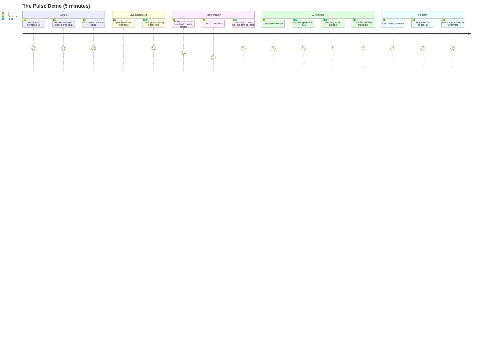

# Pulse — Business Analysis Document

**Project:** Pulse — AI-Native Observability Platform (Portfolio Edition)
**Document type:** Business Analysis (BA)
**Version:** 1.0
**Last updated:** 2026-05-09
**Status:** Side project for backend engineering interview portfolio
**Time budget:** ~150 hours over 12 weeks (2–3 hours/day)
**Owner:** Solo developer

---

## 0. Project Intent

This is a **portfolio side project**, not a startup attempt. The goal is to demonstrate, in interviews for senior backend engineering roles, that I can:

- Design and build a high-performance backend in Go.
- Use Kafka, WebSockets, and microservices in a way that shows real understanding (not just buzzwords on a resume).
- Integrate AI / LLM into a real product with cost-awareness and engineering rigor.
- Make sensible trade-offs under time and resource constraints.
- Ship something that runs end-to-end, not a half-finished prototype.

Every scope decision in this document is filtered through that lens: **does this make the demo more compelling for a 30–45 minute interview walkthrough?** If not, it's cut.

This document still uses the format of a real BA artifact (personas, use cases, requirements) because that itself is a signal: I think about systems the way a senior engineer would, even on a personal project.

---

## 1. Executive Summary

Pulse is a small but complete AI-native observability platform. An application sends logs over HTTP. The platform ingests them, detects anomalies (sudden error-rate spikes), and uses Claude to generate a Root Cause Analysis explaining what likely went wrong. Engineers see logs streaming live and incidents appearing in a dashboard.

The portfolio MVP focuses on three flagship features that interview as well:

1. **Real-time ingestion + dashboard** — Kafka-backed pipeline with WebSocket fan-out.
2. **AI-powered RCA** — anomaly fires → Claude analyzes context → engineer reads explanation in plain English. Aggressive caching keeps cost predictable.
3. **Find similar past incidents** — vector embeddings on error fingerprints, pgvector lookup.

Out of the demo: multi-tenant production-readiness, compliance, multi-region, autoscaling, observability of observability. These belong in a real company, not a side project.

---

## 2. Why This Project for This Job Description

Every requirement in the job posting maps to something concrete in the build:

| JD requirement | How Pulse demonstrates it |
|---|---|
| Backend services in Go | All three services written in Go |
| APIs and microservices | 3 services with clear boundaries, gRPC + REST + WebSocket |
| Real-time processing | Kafka + WebSocket end-to-end |
| Message queues (Kafka, RabbitMQ) | Kafka (Redpanda) for the entire event flow |
| Streaming platforms | Kafka consumer groups, exactly-once-ish processing |
| Data pipeline integration | Logs → Kafka → enricher → Postgres + pgvector |
| Various data storage (SQL, NoSQL) | Postgres (relational + time-series + vector), Redis (KV) |
| Scalability and performance | Load test demonstrating 10k logs/sec on a single VPS |
| Performance optimization | Benchmarks before/after batching, compression, connection pooling |
| Security | API key + HMAC, JWT auth, parameterized queries, threat-model doc |

Plus a bonus that's hard to demonstrate elsewhere: thoughtful AI integration with cost engineering.

---

## 3. Scope (Portfolio MVP)

### 3.1 In-scope

Log ingestion via HTTP POST with API key + HMAC authentication.
Single demo tenant (the design is multi-tenant-ready, but isolation is not stress-tested).
Kafka-based event pipeline.
Real-time log streaming dashboard via WebSocket.
Anomaly detection on error rate using rolling z-score.
AI-generated RCA via Claude Sonnet, with Redis caching.
Vector search for similar past incidents via pgvector.
Slack notifications for fired anomalies.
Simple web UI (React + Tailwind) showing live logs, incident list, and RCA detail.
Docker Compose stack that runs on a laptop in one command.
README with architecture diagram, demo GIF, benchmark numbers.
3-minute Loom demo video.
Live deployed instance on a Hetzner VPS for interviewers to click through.

### 3.2 Explicitly out-of-scope (and why)

| Feature | Why cut |
|---|---|
| SOC 2 / GDPR compliance | Not realistic at portfolio scope; flag as "future" |
| Multi-tenant production isolation (full RLS + tested) | Add `tenant_id` columns but don't pen-test |
| SSO / SAML / OAuth login | Email + password only |
| Distributed tracing | Logs only; mention OTel as future |
| Auto-instrumentation SDK | Manual logger only |
| Multiple LLM providers | Anthropic only, but with an interface |
| Natural-language → SQL search | Cool but ~25 hours; cut |
| Postmortem auto-draft | Cut |
| Custom alert rule builder UI | One default rule per service |
| PagerDuty / Opsgenie | Slack only |
| Mobile-responsive dashboard | Desktop only |
| Kubernetes deployment | Docker Compose; Helm chart is "future work" in README |
| Multi-region active-active | Single VPS |
| End-to-end PII redaction | Mention as future; ship one regex example |
| 100k logs/sec target | 10k logs/sec is plenty for demo |
| ClickHouse | TimescaleDB hypertable on Postgres is enough |

### 3.3 Future-work section in README

A clear "What I'd build next" list in the README serves two purposes: shows I know what production-grade looks like, and gives interviewers an obvious follow-up question to ask.

---

## 4. Stakeholders & Personas

Since this is a side project, the only real stakeholder is **me as the developer/applicant**. But the product should still feel like it was designed for someone, so the use cases assume the following personas as the imagined users:

### 4.1 Marcus, On-call Engineer (primary)

A backend engineer at a 50-person company who's on rotating on-call. He uses Pulse the most: he opens the dashboard when paged, reads the AI RCA, drills into logs, marks the incident resolved.

Goal: understand and fix incidents quickly without flailing through five tools.

### 4.2 Aaron, Engineering Lead (secondary)

He doesn't open Pulse every day, but he checks the incident history weekly and looks at the AI cost dashboard.

Goal: see incident trends; ensure AI cost stays sane.

That's it. Two personas. The Senior BA brain wants to write four; the side-project brain says two is enough to scope user stories.

---

## 5. Success Criteria for the Side Project

Since the goal is interview impact, the success criteria are different from a real product. They are:

### 5.1 The "30-second test"

When an interviewer opens the live demo URL, within 30 seconds they should see:

1. A live dashboard with logs streaming in.
2. A red incident card showing an active anomaly.
3. An AI RCA with a sensible-sounding explanation.

If the interviewer can't tell what the project does in 30 seconds, the demo has failed.

### 5.2 The "5-minute walkthrough"

In a 5-minute walkthrough, I should be able to demonstrate, in order:
- Run the included `make demo` script that simulates a service outage.
- Watch the dashboard turn red.
- Click the RCA panel, read the AI's analysis.
- Click "Find similar" and see one or two related historical incidents.
- Mark the incident resolved.

### 5.3 The "code review test"

When an interviewer opens the GitHub repo:
- README has architecture diagram in the first scroll.
- Code is organized cleanly (cmd/, internal/, api/).
- Tests exist and are non-trivial.
- At least one ADR (Architecture Decision Record) showing a real trade-off.
- CI pipeline visible and passing.

### 5.4 The benchmark claim

I want to be able to truthfully say: "It sustains 10,000 logs/sec on a single $40/month VPS with p99 ingest latency under 80ms." That's modest enough to be believable, impressive enough to matter.

### 5.5 Anti-goals

I am explicitly **not** trying to:
- Get users.
- Make money.
- Be production-ready.
- Compete with Datadog.
- Maximize feature count.

If a feature doesn't help the interview story, it gets cut.

---

## 6. User Journey: The Demo Story

The demo follows one continuous narrative — this is what gets recorded for the Loom video and rehearsed for the interview walkthrough.



Five minutes. Every interaction is meaningful. No "let me explain this 17-line config file" detours.

---

## 7. Use Cases (trimmed to MVP)

Down from 12 use cases to 7. Each one is essential to the demo.

### UC-01: Ingest logs from a sample app

**Actor:** Demo application (a small Go program included in the repo).
**Trigger:** App calls `POST /v1/logs` with a batch of entries.

**Main flow:**
1. App constructs HTTP request with `X-API-Key` and HMAC signature.
2. `ingest` service verifies signature.
3. Validates schema (timestamp, severity, message).
4. Publishes batch to Kafka topic `logs.raw`.
5. Returns 202 Accepted.

**Exception flows:**
- Invalid signature → 401.
- Rate limit exceeded → 429 with Retry-After.
- Kafka unavailable → buffer to local BadgerDB, retry in background.

**Business rules:**
BR-01: Default rate limit 50k logs/sec (more than enough for the demo).
BR-02: HMAC SHA-256 over body required.
BR-03: Logs > 32KB are truncated.

---

### UC-02: View live log stream

**Actor:** Engineer (Marcus persona).
**Trigger:** Opens dashboard, picks a service.

**Main flow:**
1. Browser opens WebSocket to `api` service with JWT.
2. `api` validates JWT, subscribes to Kafka topic `logs.enriched`.
3. Each new log message is filtered server-side and pushed via WS.
4. UI renders with virtual scroll (max 500 visible rows).

**Exception flow:** WS disconnect → auto-reconnect with backoff; resume from last offset.

**Business rules:**
BR-04: One WebSocket session per browser tab.
BR-05: Max 1000 logs/sec push rate (sample beyond that).

---

### UC-03: Anomaly detection fires

**Actor:** `worker` service (system-initiated).
**Trigger:** Cron-like loop every 10 seconds.

**Main flow:**
1. Worker queries TimescaleDB for the last 5 minutes of error-rate metrics per service.
2. Computes z-score against a 7-day baseline (or last hour if not enough history).
3. If |z| > 3 across 3 consecutive windows, fires anomaly event.
4. Inserts incident into Postgres with status = OPEN.
5. Publishes anomaly event to Kafka topic `anomalies.detected`.

**Exception flow:** TimescaleDB query timeout → log warning, skip cycle.

**Business rules:**
BR-06: 10-minute cooldown for the same (service, metric) pair.
BR-07: When historical data is sparse, fall back to a fixed threshold (error rate > 5%).

---

### UC-04: AI generates RCA

**Actor:** `worker` service.
**Trigger:** Consumes `anomalies.detected` event.

**Main flow:**
1. Compute fingerprint = hash(service + top error message + severity).
2. Check Redis cache `rca:{fingerprint}`. Hit → reuse existing RCA, mark `cached: true`.
3. On miss: gather context.
   - 50 most recent log entries around the anomaly window (±2 minutes).
   - Top 3 error messages by frequency.
   - 2 most similar past incidents from pgvector.
4. Render prompt with a Go template.
5. Call Claude Sonnet 4.6 with structured output (JSON schema).
6. Validate response, persist to Postgres, cache in Redis (TTL 30 min).
7. Publish `rca.completed` event.

**Alternative flow (degraded mode):**
LLM error or timeout > 20s → fall back to a rule-based template:
"Service X is showing error rate Y% (baseline Z%). Most common error: '...'. Last detected at T."

**Business rules:**
BR-08: Max one Sonnet call per fingerprint per 30 minutes.
BR-09: Hard daily cap: $5/day on LLM cost (kill switch beyond that).
BR-10: Every RCA includes "AI-generated, verify before acting" footer.

---

### UC-05: Engineer reads the RCA

**Actor:** Engineer.
**Trigger:** Receives Slack notification or sees red badge in dashboard.

**Main flow:**
1. Click incident card in UI.
2. UI fetches incident detail from `api`.
3. UI renders RCA with markdown: summary, likely cause, suggested actions, evidence (linked logs).
4. Optional: click 👍/👎 to give feedback (stored, used for prompt improvement).

**Business rules:**
BR-11: Evidence log links open in a side panel without leaving the incident view.

---

### UC-06: Find similar past incidents

**Actor:** Engineer.
**Trigger:** Click "Find similar" button on an incident.

**Main flow:**
1. UI calls `GET /v1/incidents/{id}/similar`.
2. `api` retrieves the incident's embedding.
3. pgvector cosine search: top 3 incidents with similarity > 0.7, status = RESOLVED.
4. Returns: time, service, MTTR, resolution note.
5. UI renders a small timeline next to the current incident.

**Business rules:**
BR-12: Skip incidents older than 90 days.

---

### UC-07: Acknowledge / resolve an incident

**Actor:** Engineer.
**Trigger:** Click Acknowledge or Resolve button.

**Main flow (Acknowledge):**
1. POST `/v1/incidents/{id}/ack`.
2. Status updates to ACKNOWLEDGED.
3. Slack thread updates: "Marcus acknowledged at 14:32".

**Main flow (Resolve):**
1. Engineer picks resolution category (deploy issue / external / code bug / infra / other).
2. Adds a one-line note.
3. Status = RESOLVED, MTTR computed and stored.

**Business rules:**
BR-13: Resolution note is required (forces actual postmortem habit).

---

## 8. Functional Requirements

| ID | Requirement | Priority |
|---|---|---|
| FR-01 | HTTP `/v1/logs` accepts batches up to 500 entries / 2MB | Must |
| FR-02 | Ingest sustains 10,000 logs/sec on a single VPS | Must |
| FR-03 | Logs appear in dashboard within 3s of ingestion | Must |
| FR-04 | Anomaly detection runs every 10 seconds | Must |
| FR-05 | RCA generated within 15s of anomaly firing | Must |
| FR-06 | RCA caching achieves > 50% hit rate during typical demo | Must |
| FR-07 | Vector search returns similar incidents in < 500ms | Must |
| FR-08 | Slack notification sent within 5s of incident | Should |
| FR-09 | Incident has 4 states: OPEN, ACKNOWLEDGED, RESOLVED, DISMISSED | Must |
| FR-10 | Dashboard shows live log stream with pause/resume | Must |
| FR-11 | All actions are logged in an audit trail (basic, not enterprise-grade) | Should |
| FR-12 | LLM cost is tracked per call and visible in a simple dashboard | Should |

---

## 9. Non-Functional Requirements

### 9.1 Performance (modest, achievable, demonstrable)

| ID | Requirement |
|---|---|
| NFR-P-01 | Ingest p99 < 80ms at 10k logs/sec |
| NFR-P-02 | Dashboard log latency p95 < 3s |
| NFR-P-03 | RCA generation p95 < 15s |
| NFR-P-04 | Search query p95 < 1s |
| NFR-P-05 | WebSocket supports 100 concurrent connections (more than enough for demo) |

### 9.2 Reliability

| ID | Requirement |
|---|---|
| NFR-R-01 | Local Kafka buffer prevents log loss during 5-minute Kafka outage |
| NFR-R-02 | LLM provider outage degrades to rule-based RCA, not failure |
| NFR-R-03 | All Postgres writes are transactional |

### 9.3 Security (basic but real)

| ID | Requirement |
|---|---|
| NFR-S-01 | API key + HMAC SHA-256 on ingest endpoint |
| NFR-S-02 | JWT for dashboard auth (15-min access token) |
| NFR-S-03 | Parameterized queries everywhere |
| NFR-S-04 | bcrypt for password hashing |
| NFR-S-05 | TLS in production (Caddy auto-cert) |
| NFR-S-06 | Hard daily LLM cost cap (cost-DoS protection) |
| NFR-S-07 | Threat model section in README |

### 9.4 Cost

| ID | Requirement |
|---|---|
| NFR-C-01 | Total infra cost ≤ $40/month for live demo (Hetzner CCX13 + domain) |
| NFR-C-02 | LLM cost ≤ $5/day during normal demo usage |

### 9.5 Code quality (the interview-relevant ones)

| ID | Requirement |
|---|---|
| NFR-Q-01 | Test coverage ≥ 60% on `internal/` packages |
| NFR-Q-02 | No `golangci-lint` warnings on default config |
| NFR-Q-03 | All public functions have godoc comments |
| NFR-Q-04 | At least 3 ADRs documenting non-obvious decisions |
| NFR-Q-05 | CI pipeline runs lint + test + build on every PR |

---

## 10. Acceptance Criteria (key scenarios)

### AC for UC-01 (Ingestion)

```gherkin
Feature: Log ingestion

  Scenario: Successful batch ingestion
    Given a valid API key "pk_demo_xxx"
    When the demo app sends 100 log entries with valid HMAC
    Then response is 202
    And accepted_count = 100
    And the logs appear in Kafka topic "logs.raw" within 1 second

  Scenario: Invalid signature
    When a request comes with a wrong HMAC signature
    Then response is 401
    And no log is published to Kafka
```

### AC for UC-04 (AI RCA)

```gherkin
Feature: AI-generated RCA

  Scenario: First-time anomaly triggers LLM call
    Given an anomaly with no prior cache entry
    When the worker processes the anomaly
    Then it gathers context from logs and similar incidents
    And calls Claude Sonnet with structured output
    And persists the RCA to Postgres
    And caches the result in Redis with TTL 30 min

  Scenario: Repeated anomaly hits cache
    Given a previous RCA exists for fingerprint "xyz"
    When a new anomaly with the same fingerprint fires
    Then the cached RCA is reused
    And no LLM API call is made
    And the response time is under 200ms

  Scenario: LLM provider failure falls back to template
    Given the Anthropic API is returning errors
    When an anomaly fires
    Then a rule-based RCA is generated within 1 second
    And the UI shows a banner "AI analysis unavailable, showing basic summary"
```

---

## 11. 12-Week Build Plan

The plan assumes ~2.5 hours of focused work per day, ~5 days a week. That's roughly 12.5 hours/week, ~150 hours total. Buffer of 10–15% built into each phase for life happening.

### Week 1–2 — Foundation (~25 hrs)

- Set up Go monorepo with `go.work`, three service skeletons (`cmd/ingest`, `cmd/api`, `cmd/worker`).
- Docker Compose with Postgres 16 + pgvector + TimescaleDB extension, Redis 7, Redpanda (single-node).
- DB migrations using `golang-migrate`. Initial schema for tenants, users, api_keys, incidents, llm_calls, audit_logs.
- Basic `health` endpoint on each service.
- GitHub Actions CI: lint, test, build.
- Makefile: `make up`, `make test`, `make seed`, `make demo`.

**Deliverable:** repo runs `make up` and three services come up healthy.

### Week 3–4 — Ingestion Pipeline (~25 hrs)

- `ingest`: HTTP `/v1/logs` endpoint with API key + HMAC.
- Rate limiting via Redis token bucket.
- Kafka producer with batching, idempotent.
- BadgerDB local fallback buffer.
- `worker`: enricher consumer that parses, computes fingerprint, writes to TimescaleDB hypertable.
- Demo script `cmd/sim/main.go` that generates synthetic logs.

**Deliverable:** logs flow end-to-end, visible by querying Postgres.

### Week 5–6 — Realtime + Dashboard (~25 hrs)

- `api`: WebSocket endpoint with JWT auth.
- WS subscribes to Kafka, fans out filtered messages.
- React + Vite + Tailwind frontend skeleton.
- Live log table with pause/resume.
- Login screen, basic auth flow.

**Deliverable:** open browser, watch logs streaming live.

### Week 7–8 — Anomaly Detection (~25 hrs)

- `worker`: anomaly detector loop every 10s.
- Z-score implementation with 7-day baseline.
- Cooldown logic.
- Persist incident to Postgres.
- Publish anomaly event.
- WS pushes anomaly to dashboard.
- UI: incident list page, status badges.

**Deliverable:** trigger fake errors → see incident appear in UI within 60 seconds.

### Week 9–10 — AI Integration (~25 hrs)

- LLM client wrapping Anthropic SDK with timeout, retry, JSON-mode.
- Embedding generation on first occurrence of new error fingerprint (Voyage or OpenAI embeddings — whichever is cheaper at the time).
- pgvector schema and HNSW index.
- ai-rca pipeline: fingerprint → cache check → context gather → LLM call → cache + persist → publish.
- Find-similar endpoint with pgvector.
- UI: incident detail page with RCA, similar incidents.
- Cost tracking: every LLM call logged to `llm_calls` table.
- Hard daily cost cap with kill switch.

**Deliverable:** the headline demo works — anomaly → RCA visible in UI in ~10–15 seconds.

### Week 11 — Polish (~12 hrs)

- Slack notification webhook.
- Resolve incident flow with category + note.
- Simple cost dashboard (one Recharts line chart).
- Empty states, loading states, error handling.
- `make demo` reset + replay scripts for clean walkthrough.

### Week 12 — Demo Production (~13 hrs)

- Deploy to Hetzner CCX13 with Caddy + TLS.
- Load test with k6: confirm 10k logs/sec sustained.
- Write README: architecture diagram (Mermaid), demo GIF, benchmark numbers, threat model, ADR links.
- Record 3-minute Loom demo video.
- Write 1500–2000-word blog post: "Building an AI-Native Observability Platform: What I Learned About LLM Cost Engineering".
- Polish GitHub repo description, topics, pinned status.

**Total:** ~150 hours over 12 weeks.

### Buffer / risk

If a phase runs over by more than ~5 hours, the cut list (in priority order):
1. Slack integration → drop, just show in-UI notifications.
2. Find-similar feature → drop (but RCA stays).
3. Cost dashboard → drop, just log to DB.
4. Reduce frontend polish.

The **non-negotiable core**: ingestion → anomaly → RCA → dashboard. Everything else is nice-to-have.

---

## 12. Risks and Mitigations

| Risk | Probability | Mitigation |
|---|---|---|
| Scope creep | High | Strict cut list; weekly self-review against the plan |
| Stuck on a hard bug for days | Medium | If a problem doesn't yield in 3 sessions, simplify or work around |
| LLM cost surprise during dev | Low | $5/day cap from week 1; mock LLM in tests |
| Frontend rabbit hole | Medium | Use shadcn/ui; don't design from scratch |
| Hetzner VPS instability | Low | Keep Docker Compose backup; can demo locally if needed |
| Burnout from 2hrs/day routine | Medium | Track hours, force one full rest day per week |
| AI provider API changes | Low | Pin SDK version; abstract provider interface |
| Job application timing pressure | High | Prioritize getting *anything* deployable by Week 8 |

---

## 13. What This Project Says About the Candidate

When I send the GitHub link with my resume, the implicit message is:

**"I can scope a project realistically."** I cut features explicitly. The README's "future work" section shows I see the whole iceberg, not just the tip I built.

**"I think about cost, not just code."** Hard daily LLM cap, caching strategy, FinOps section in the architecture doc. Most junior portfolios skip this.

**"I write production-flavored code, even at home."** Tests, CI, ADRs, threat model, structured logging.

**"I can integrate AI without falling for the hype."** The system degrades gracefully when the LLM is unavailable. Tiered model strategy. Cost cap. Disclaimer on AI output.

**"I can communicate."** Two documents (this one + architecture.md) that follow industry conventions.

---

## 14. Glossary

| Term | Definition |
|---|---|
| Anomaly | A metric event that exceeds the statistical baseline (z-score > 3) |
| Incident | An anomaly persisted with a lifecycle (open → ack → resolve) |
| RCA | Root Cause Analysis — AI-generated explanation of likely cause |
| MTTR | Mean Time To Resolve — alert to resolved (tracked but not optimized in MVP) |
| Fingerprint | Hash of (service + top error message + severity) used for dedup and caching |
| Embedding | Vector representation of an error message for similarity search |
| Cooldown | Time window after an anomaly fires during which duplicate alerts are suppressed |
| Tiered LLM | Strategy of using cheap model (Haiku) for simple tasks and expensive model (Sonnet) only when quality matters |

---

**End of Business Analysis Document**
